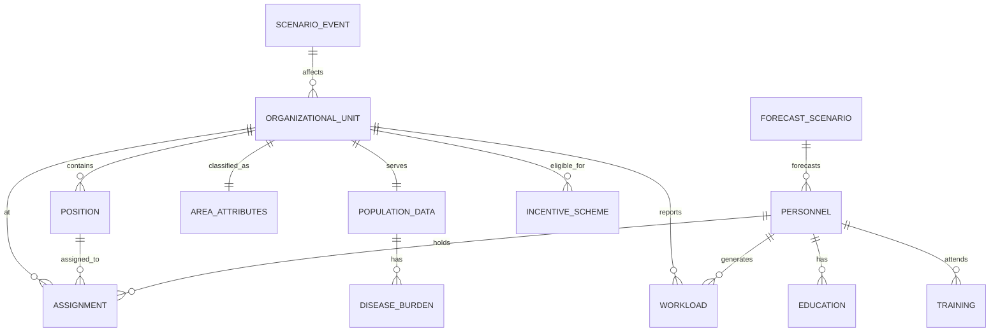

# Data Requirements Document
## HR Blueprint - เขตสุขภาพที่ 1 (Updated with Regional Context)

**Version:** 2.0  
**Date:** 2026-02-14  
**Author:** HR Blueprint Analysis Team  
**Status:** Final Draft

---

## Executive Summary

เอกสารนี้กำหนดความต้องการข้อมูลทั้งหมดสำหรับการพัฒนาเครื่องมือ HR Blueprint สำหรับเขตสุขภาพที่ 1 (8 จังหวัดภาคเหนือตอนบน) ครอบคลุม:
- ข้อมูลบุคลากร (Personnel Data)
- ข้อมูลภาระงาน (Workload Data)
- ข้อมูลความต้องการสุขภาพ (Health Need Data)
- ข้อมูลการคาดการณ์ (Forecasting Data)
- ข้อมูลเชิงพื้นที่ (Geographic Data) **← NEW**
- ข้อมูลบริบทพิเศษ (Border/Remote/Tourism) **← NEW**

**พื้นที่รับผิดชอบ:** เชียงใหม่, เชียงราย, แพร่, น่าน, ลำพูน, ลำปาง, แม่ฮ่องสอน, พะเยา

**สถานการณ์ปัจจุบัน (ม.ค. 2026):** ขาดแคลนแพทย์ 29 คน (เชียงราย 18, เชียงใหม่ 18, น่าน 6)

---

## Table of Contents

1. [Business Context & Regional Profile](#1-business-context--regional-profile)
2. [Data Sources](#2-data-sources)
3. [Area Classification Framework](#3-area-classification-framework) **← NEW**
4. [Data Entities & Relationships](#4-data-entities--relationships)
5. [Detailed Data Requirements](#5-detailed-data-requirements)
6. [Regional-Specific Data Models](#6-regional-specific-data-models) **← NEW**
7. [Data Quality Requirements](#7-data-quality-requirements)
8. [Scenario Planning Data](#8-scenario-planning-data) **← NEW**
9. [Reporting & Analytics](#9-reporting--analytics)
10. [Data Security & Privacy](#10-data-security--privacy)
11. [Appendices](#11-appendices)

---

## 1. Business Context & Regional Profile

### 1.1 บริบทเขตสุขภาพที่ 1

| ลักษณะ | รายละเอียด |
|--------|------------|
| **พื้นที่** | 8 จังหวัดภาคเหนือตอนบน |
| **ภูมิประเทศ** | 71% ภูเขา, 10% เกษตรกรรม, 19% ที่อยู่อาศัย |
| **ประชากร** | ~5-6 ล้านคน (เชียงใหม่ ~1.8 ล้าน) |
| **พื้นที่ชายแดน** | เชียงราย (ไทย-พม่า-ลาว), แม่ฮ่องสอน (ไทย-พม่า) |
| **พื้นที่ท่องเที่ยว** | เชียงใหม่, เชียงราย, น่าน, ลำปาง, แม่ฮ่องสอน |
| **พื้นที่ห่างไกล** | น่าน (87.2% ภูเขา), แม่ฮ่องสอน, บางอำเภอเชียงราย |

### 1.2 สถานการณ์วิกฤตปัจจุบัน (ม.ค. 2026)

#### ขาดแคลนแพทย์ระดับวิกฤต

| จังหวัด | ขาดแพทย์ | รพช. ที่ขาด | ระดับความรุนแรง |
|---------|----------|-------------|----------------|
| **เชียงราย** | 18 คน | 4 แห่ง | 🔴 สีแดง (>40%) |
| **เชียงใหม่** | 18 คน | 4 แห่ง | 🔴 สีแดง (>40%) |
| **น่าน** | 6 คน | 2 แห่ง | 🟠 สีส้ม (20-40%) |
| **แม่ฮ่องสอน** | รวมในแผน | หลายแห่ง | 🔴 ต่อเนื่อง |

**รพช. วิกฤตที่ต้องจับตา:**
- รพ.แม่สาย (เชียงราย) - ชายแดน พื้นที่สีแดง
- รพ.ศรีสังวาลย์ (แม่ฮ่องสอน) - ห่างไกลที่สุด
- รพช. ในพื้นที่ภูเขา/ชายแดน

### 1.3 ภารกิจคณะกรรมการ HR Blueprint (6 ประการ)

1. **วิเคราะห์สถานการณ์กำลังคน** - 8 จังหวัด โดยใช้ข้อมูลประชากร ภาระโรค การเข้าถึงบริการ
2. **จัดทำแผนระยะ 5 ปี และ 10 ปี** - ครอบคลุมสาขาหลักและเฉพาะทาง
3. **วิเคราะห์ภาระงานจริง** - Case-mix, Complexity, OPD/IPD load
4. **บูรณาการแผนกับระบบบริการ** - Service Plan, งบประมาณ, โครงสร้างพื้นฐาน
5. **เสนอรูปแบบการจัดกำลังคนที่ยืดหยุ่น** - Telemedicine, Mobile Team, Cross-unit collaboration
6. **จัดทำข้อเสนอเชิงนโยบาย** - ผลักดันมาตรการจูงใจพื้นที่วิกฤต

### 1.4 Gap Analysis (ปัญหาหลัก)

| ปัญหา | ผลกระทบในพื้นที่ | ข้อมูลที่ต้องการ |
|-------|-----------------|-----------------|
| **Fragmented Planning** | แผนไม่เชื่อมโยงกับภาระงานจริง | Single Source of Truth |
| **Workload Mismatch** | ไม่คำนึงถึง Case-mix, นักท่องเที่ยว | ข้อมูลภาระงานจริง |
| **Training Pipeline Blind Spot** | ส่งเรียนแต่ไม่มี Backfill | ข้อมูลการเรียนต่อ |
| **Geographic Inequity** | พื้นที่ห่างไกล/ชายแดนไม่มีใครไป | ข้อมูลพื้นที่ + มาตรการจูงใจ |
| **No Scenario Planning** | ไม่รับมือกับ Peak tourism, ภัยธรรมชาติ | ข้อมูลสถานการณ์ |

---

## 2. Data Sources

### 2.1 Primary Data Sources (Internal)

| แหล่งข้อมูล | ระบบ | ความถี่ | รูปแบบ | หน่วยงาน |
|------------|------|---------|--------|----------|
| ข้อมูลบุคลากร | HRHIS / จ.18 | รายเดือน | Excel, DB | สำนักงานเขตฯ |
| ข้อมูลตำแหน่ง | ระบบอัตรากำลัง | รายเดือน | Excel | กรมสรรพากร |
| ข้อมูลการศึกษา | ระบบฝึกอบรม | รายไตรมาส | DB | สำนักพัฒนา |
| ข้อมูลการเคลื่อนไหว | ระบบการย้าย | Real-time | API | HRHIS |
| ข้อมูลเงินเดือน | ระบบงบประมาณ | รายเดือน | DB | การเงิน |
| ข้อมูลวันลา | ระบบลา | รายวัน | DB | HRHIS |
| **ข้อมูลผู้ป่วย** | **HOSxP / 43 แฟ้ม** | **รายวัน** | **DB** | **โรงพยาบาล** |
| **ข้อมูลการท่องเที่ยว** | **MOPH + ททท.** | **รายเดือน** | **API** | **หน่วยงาน** |

### 2.2 Secondary Data Sources (External)

| แหล่งข้อมูล | หน่วยงาน | ความถี่ | รูปแบบ |
|------------|----------|---------|--------|
| ข้อมูลประชากร | สำนักงานสถิติฯ | รายปี | Excel, API |
| ข้อมูลภาระโรค NCD | กรมควบคุมโรค | รายปี | DB |
| Service Plan Targets | สปสช. | รายปี | PDF, Excel |
| ข้อมูลสถานบริการ | สำนักปลัด สธ. | รายปี | DB |
| การผลิตบุคลากร | สภาวิชาชีพ | รายปี | Excel |
| **ข้อมูลนักท่องเที่ยว** | **การท่องเที่ยวแห่งประเทศ** | **รายเดือน** | **API** |
| **ข้อมูลชายแดน** | **กองทัพ/ตม.** | **รายเดือน** | **Report** |
| **ข้อมูลภัยธรรมชาติ** | **กรมป้องกันฯ** | **Real-time** | **API** |

### 2.3 Real-time Data Requirements

- การบรรจุ/แต่งตั้งใหม่
- การลาออก/เกษียณ
- การย้าย/โอน
- การลา/มาทำงาน
- การเปลี่ยนแปลงตำแหน่ง
- **ผู้ป่วยฉุกเฉิน/Referral** ← NEW
- **นักท่องเที่ยวป่วย** ← NEW

---

## 3. Area Classification Framework

### 3.1 การจำแนกประเภทพื้นที่ (Zoning)

```
┌─────────────────────────────────────────────────────────────────┐
│                    AREA CLASSIFICATION MODEL                     │
├─────────────────────────────────────────────────────────────────┤
│                                                                  │
│  ┌─────────────────────────────────────────────────────────┐   │
│  │  ZONE A: URBAN/TOURISM HUB                              │   │
│  │  - เชียงใหม่เมือง, อำเภอเมืองเชียงราย                   │   │
│  │  - ศูนย์กลางการแพทย์ระดับตติยภูมิ                       │   │
│  │  - ประชากรแฝงสูง, นักท่องเที่ยวมาก                      │   │
│  │  - เน้น: ความเชี่ยวชาญสูง, หลากหลายสาขา               │   │
│  └─────────────────────────────────────────────────────────┘   │
│                                                                  │
│  ┌─────────────────────────────────────────────────────────┐   │
│  │  ZONE B: RURAL                                          │   │
│  │  - อำเภอในเชียงใหม่, ลำปาง, ลำพูน, แพร่, พะเยา         │   │
│  │  - พื้นที่เกษตรกรรมเป็นหลัก                             │   │
│  │  - เน้น: หลายสาขา, ทั่วไป                               │   │
│  └─────────────────────────────────────────────────────────┘   │
│                                                                  │
│  ┌─────────────────────────────────────────────────────────┐   │
│  │  ZONE C: REMOTE/MOUNTAINOUS                             │   │
│  │  - น่าน (87.2% ภูเขา), แม่ฮ่องสอน, อำเภอภูเขาอื่นๆ    │   │
│  │  - เข้าถึงยาก, ใช้ Telemedicine                         │   │
│  │  - เน้น: Mobile Team, Telemedicine, อสม.               │   │
│  └─────────────────────────────────────────────────────────┘   │
│                                                                  │
│  ┌─────────────────────────────────────────────────────────┐   │
│  │  ZONE D: BORDER                                         │   │
│  │  - แม่สาย, แม่ฮ่องสอน, ชายแดนเชียงราย                  │   │
│  │  - วิกฤตขาดแคลน, ค่าตอบแทน 2x                         │   │
│  │  - เน้น: ความมั่นคง, ค่าตอบแทนพิเศษ, หมุนเวียน        │   │
│  └─────────────────────────────────────────────────────────┘   │
│                                                                  │
└─────────────────────────────────────────────────────────────────┘
```

### 3.2 Area Classification Attributes

| Attribute | Type | Description | Values |
|-----------|------|-------------|--------|
| area_classification | VARCHAR(20) | ประเภทพื้นที่ | 'urban', 'rural', 'remote', 'border', 'tourism' |
| terrain_type | VARCHAR(20) | ลักษณะภูมิประเทศ | 'flat', 'hilly', 'mountainous' |
| terrain_difficulty | INTEGER | ความลำบาก 1-5 | 1=ราบ, 5=ภูเขาสูงมาก |
| border_country | VARCHAR(50) | ชายแดนติดประเทศ | 'Myanmar', 'Laos', null |
| border_distance_km | DECIMAL | ระยะห่างจากชายแดน (กม.) | 0-100 |
| tourism_level | INTEGER | ระดับการท่องเที่ยว 1-5 | 1=ต่ำ, 5=สูงมาก |
| access_time_to_district | INTEGER | เวลาไป รพ.อำเภอ (นาที) | 0-300 |
| access_time_to_provincial | INTEGER | เวลาไป รพ.จังหวัด (นาที) | 0-600 |
| road_condition | VARCHAR(20) | สภาพถนน | 'paved', 'unpaved', 'seasonal' |
| internet_availability | BOOLEAN | มี Internet/Telemedicine | true/false |
| mobile_signal_strength | VARCHAR(10) | ความแรงสัญญาณ | 'strong', 'moderate', 'weak', 'none' |
| hardship_level | INTEGER | ระดับความลำบาก 1-5 | 1=ปกติ, 5=ลำบากมาก |
| incentive_eligible | BOOLEAN | สิทธิ์ค่าตอบแทนพิเศษ | true/false |
| incentive_multiplier | DECIMAL | คูณค่าตอบแทน | 1.0, 1.5, 2.0 |

---

## 4. Data Entities & Relationships

### 4.1 Conceptual Data Model (CDM)

```
┌─────────────────────────────────────────────────────────────────────────┐
│                        HR BLUEPRINT SYSTEM                               │
├─────────────────────────────────────────────────────────────────────────┤
│                                                                          │
│  ┌──────────────┐    ┌──────────────┐    ┌──────────────┐              │
│  │   PERSONNEL  │◄──►│   POSITION   │◄──►│    UNIT      │              │
│  │              │    │              │    │   (Area      │              │
│  │ - Personal   │    │ - Position   │    │   Class)     │              │
│  │   Info       │    │   Details    │    │ - Location   │              │
│  │ - Education  │    │ - Status     │    │ - Type       │              │
│  │ - Training   │    │ - Level      │    │ - Terrain    │              │
│  │ - History    │    │ - Zone       │    │ - Incentive  │              │
│  └──────┬───────┘    └──────────────┘    └──────────────┘              │
│         │                                                                │
│         │ ┌──────────────┐    ┌──────────────┐    ┌──────────────┐     │
│         └►│  WORKLOAD    │    │   EDUCATION  │    │   AREA_ATTR  │     │
│           │              │    │              │    │   (NEW)      │     │
│           │ - OPD Visits │    │ - Degrees    │    │ - Border     │     │
│           │ - IPD Cases  │    │ - Training   │    │ - Tourism    │     │
│           │ - Tourist    │    │ - Licenses   │    │ - Remote     │     │
│           │ - Border     │    │ - CME        │    │ - Hardship   │     │
│           └──────────────┘    └──────────────┘    └──────────────┘     │
│                                                                          │
│  ┌──────────────┐    ┌──────────────┐    ┌──────────────┐              │
│  │   POPULATION │    │ DISEASE      │    │  FORECAST    │              │
│  │              │    │ BURDEN       │    │  SCENARIO    │              │
│  │ - Demographic│    │              │    │              │              │
│  │ - Tourist    │    │ - Prevalence │    │ - Baseline   │              │
│  │ - Border     │    │ - NCD        │    │ - Tourism    │              │
│  │              │    │ - Accident   │    │ - Border     │              │
│  └──────────────┘    └──────────────┘    └──────────────┘              │
│                                                                          │
│  ┌──────────────┐    ┌──────────────┐                                  │
│  │   INCENTIVE  │    │  SCENARIO    │                                  │
│  │   (NEW)      │    │  EVENT       │                                  │
│  │              │    │   (NEW)      │                                  │
│  │ - Hardship   │    │              │                                  │
│  │ - Border     │    │ - Natural    │                                  │
│  │ - Tourism    │    │   Disaster   │                                  │
│  │ - Rotation   │    │ - Pandemic   │                                  │
│  └──────────────┘    └──────────────┘                                  │
│                                                                          │
└─────────────────────────────────────────────────────────────────────────┘
```

### 4.2 Entity Relationship Diagram (ERD)



### 4.3 Core Entities (Updated)

#### 1. PERSONNEL (บุคลากร)

```sql
CREATE TABLE personnel (
    personnel_id UUID PRIMARY KEY,
    citizen_id VARCHAR(13) UNIQUE NOT NULL,
    employee_id VARCHAR(20) UNIQUE,
    professional_license VARCHAR(50),
    
    -- Personal Info
    prefix_name VARCHAR(20),
    first_name VARCHAR(100),
    last_name VARCHAR(100),
    gender ENUM('male', 'female', 'other'),
    birthdate DATE,
    nationality VARCHAR(50),
    ethnicity VARCHAR(50),
    religion VARCHAR(20),
    marital_status VARCHAR(20),
    
    -- Contact Info
    address TEXT,
    phone VARCHAR(20),
    email VARCHAR(100),
    emergency_contact VARCHAR(100),
    
    -- Employment Info
    employment_type ENUM('civil_servant', 'government_officer', 'moph_employee', 'permanent_employee', 'temporary_employee'),
    employment_status ENUM('active', 'leave', 'secondment', 'suspended', 'retired'),
    enrollment_date DATE,
    retirement_date DATE,
    years_of_service INTEGER GENERATED,
    
    -- Area Preferences
    preferred_zone VARCHAR(20), -- 'urban', 'rural', 'remote', 'border'
    willing_remote BOOLEAN,
    willing_border BOOLEAN,
    max_hardship_level INTEGER,
    
    -- Metadata
    created_at TIMESTAMP DEFAULT CURRENT_TIMESTAMP,
    updated_at TIMESTAMP DEFAULT CURRENT_TIMESTAMP
);
```

#### 2. ORGANIZATIONAL_UNIT (หน่วยงาน + Area Classification)

```sql
CREATE TABLE organizational_unit (
    unit_id UUID PRIMARY KEY,
    unit_code_18 VARCHAR(20) UNIQUE NOT NULL,
    unit_name VARCHAR(255),
    unit_name_en VARCHAR(255),
    
    -- Hierarchy
    unit_type ENUM('hospital_center', 'hospital_general', 'hospital_community', 'health_promoting_hospital', 'health_center'),
    parent_unit_id UUID,
    province_code VARCHAR(2),
    province_name VARCHAR(100),
    amphur_code VARCHAR(4),
    amphur_name VARCHAR(100),
    tambon_code VARCHAR(6),
    tambon_name VARCHAR(100),
    region VARCHAR(1),
    
    -- Service Plan
    service_plan_type ENUM('A', 'B', 'C', 'F1', 'F2', 'F3'),
    bed_count INTEGER,
    bed_icu_count INTEGER,
    bed_occupancy_rate DECIMAL(5,2),
    
    -- AREA CLASSIFICATION (NEW)
    area_classification VARCHAR(20), -- 'urban', 'rural', 'remote', 'border', 'tourism'
    terrain_type VARCHAR(20), -- 'flat', 'hilly', 'mountainous'
    terrain_difficulty INTEGER CHECK (terrain_difficulty BETWEEN 1 AND 5),
    
    -- Border Specific
    border_country VARCHAR(50), -- 'Myanmar', 'Laos', null
    border_distance_km DECIMAL(10,2),
    border_checkpoint_name VARCHAR(100),
    
    -- Tourism Specific
    tourism_level INTEGER CHECK (tourism_level BETWEEN 1 AND 5),
    tourism_type VARCHAR(100), -- 'cultural', 'nature', 'medical', 'adventure'
    peak_tourist_season VARCHAR(50), -- 'Nov-Feb', 'Year-round'
    
    -- Access & Infrastructure
    access_time_to_district INTEGER, -- minutes
    access_time_to_provincial INTEGER, -- minutes
    road_condition VARCHAR(20), -- 'paved', 'unpaved', 'seasonal'
    internet_availability BOOLEAN,
    mobile_signal_strength VARCHAR(10), -- 'strong', 'moderate', 'weak', 'none'
    telemedicine_capable BOOLEAN,
    
    -- Hardship & Incentive
    hardship_level INTEGER CHECK (hardship_level BETWEEN 1 AND 5),
    incentive_eligible BOOLEAN,
    incentive_multiplier DECIMAL(3,1) DEFAULT 1.0, -- 1.0, 1.5, 2.0
    hardship_allowance DECIMAL(10,2),
    border_allowance DECIMAL(10,2),
    remote_allowance DECIMAL(10,2),
    
    -- Location
    latitude DECIMAL(10,8),
    longitude DECIMAL(11,8),
    elevation_meters INTEGER,
    
    -- Metadata
    created_at TIMESTAMP DEFAULT CURRENT_TIMESTAMP,
    updated_at TIMESTAMP DEFAULT CURRENT_TIMESTAMP,
    
    FOREIGN KEY (parent_unit_id) REFERENCES organizational_unit(unit_id)
);
```

#### 3. POSITION (ตำแหน่ง + Zone)

```sql
CREATE TABLE position (
    position_id UUID PRIMARY KEY,
    position_code VARCHAR(20) UNIQUE NOT NULL,
    position_name_th VARCHAR(255),
    position_name_en VARCHAR(255),
    
    -- Classification
    position_category VARCHAR(50), -- 'medical', 'nursing', 'pharmacy', 'allied_health', 'admin'
    position_type VARCHAR(50), -- 'administrative', 'specialist', 'line', 'support'
    specialty VARCHAR(100), -- 'internal_medicine', 'surgery', 'pediatrics', etc.
    specialty_sub VARCHAR(100), -- 'cardiology', 'orthopedics', etc.
    
    -- Zone & Location
    zone_requirement VARCHAR(20), -- 'any', 'urban_only', 'rural_ok', 'remote_preferred', 'border_only'
    unit_id UUID,
    department_code VARCHAR(20),
    
    -- FTE & Status
    fte_value DECIMAL(3,2) DEFAULT 1.00,
    position_status ENUM('filled', 'vacant', 'frozen', 'abolished'),
    vacancy_reason VARCHAR(255),
    vacancy_duration_days INTEGER,
    
    -- Requirements
    required_education_level VARCHAR(50),
    required_license VARCHAR(50),
    required_experience_years INTEGER,
    required_specialty_training BOOLEAN,
    
    -- Incentive
    incentive_level VARCHAR(10), -- 'normal', 'increased', 'special'
    hardship_eligible BOOLEAN,
    
    -- Dates
    effective_date DATE,
    end_date DATE,
    
    FOREIGN KEY (unit_id) REFERENCES organizational_unit(unit_id)
);
```

#### 4. WORKLOAD (ภาระงาน - Enhanced)

```sql
CREATE TABLE workload (
    workload_id UUID PRIMARY KEY,
    unit_id UUID NOT NULL,
    personnel_id UUID,
    period_year INTEGER,
    period_month INTEGER,
    
    -- OPD
    opd_total_visits INTEGER,
    opd_visits_per_physician DECIMAL(10,2),
    opd_new_cases INTEGER,
    opd_followup_cases INTEGER,
    opd_referrals_in INTEGER,
    opd_referrals_out INTEGER,
    
    -- IPD
    ipd_total_admissions INTEGER,
    ipd_cases_per_physician DECIMAL(10,2),
    ipd_discharges INTEGER,
    ipd_deaths INTEGER,
    ipd_avg_length_of_stay DECIMAL(5,2),
    case_mix_index DECIMAL(5,2),
    
    -- Surgery & Procedures
    surgery_major_count INTEGER,
    surgery_minor_count INTEGER,
    surgery_emergency_count INTEGER,
    procedure_total_count INTEGER,
    
    -- Emergency
    er_total_visits INTEGER,
    er_admissions INTEGER,
    er_referrals INTEGER,
    er_deaths INTEGER,
    
    -- REGIONAL SPECIFIC (NEW)
    tourist_patients INTEGER, -- ผู้ป่วยนักท่องเที่ยว
    tourist_emergency INTEGER, -- นักท่องเที่ยวฉุกเฉิน
    border_patients INTEGER, -- ผู้ป่วยต่างด้าวชายแดน
    cross_border_referrals INTEGER, -- ส่งต่อข้ามแดน
    mobile_clinic_visits INTEGER, -- คลินิกเคลื่อนที่
    telemedicine_cases INTEGER, -- เคส Telemedicine
    
    -- Workload Indicators
    nurse_patient_ratio DECIMAL(5,2),
    bed_occupancy_rate DECIMAL(5,2),
    bed_turnover_rate DECIMAL(5,2),
    
    -- Time & Burnout
    avg_working_hours_per_week DECIMAL(5,2),
    overtime_hours INTEGER,
    on_call_frequency INTEGER,
    burnout_risk_score INTEGER, -- 1-10
    
    FOREIGN KEY (unit_id) REFERENCES organizational_unit(unit_id),
    FOREIGN KEY (personnel_id) REFERENCES personnel(personnel_id)
);
```

#### 5. TRAINING (การฝึกอบรม + Pipeline)

```sql
CREATE TABLE training (
    training_id UUID PRIMARY KEY,
    personnel_id UUID NOT NULL,
    
    -- Training Details
    training_type VARCHAR(50), -- 'specialization', 'residency', 'fellowship', 'short_course', 'workshop'
    specialty_name VARCHAR(255),
    sub_specialty VARCHAR(255),
    
    -- Institution
    institution VARCHAR(255),
    institution_type ENUM('domestic', 'international'),
    country VARCHAR(100),
    
    -- Timeline
    start_date DATE,
    expected_end_date DATE,
    actual_end_date DATE,
    duration_months INTEGER,
    
    -- Status
    status ENUM('pending', 'in_progress', 'completed', 'dropped', 'postponed'),
    completion_percentage INTEGER,
    
    -- Backfill Management
    original_unit_id UUID,
    backfill_personnel_id UUID,
    backfill_arranged BOOLEAN,
    backfill_start_date DATE,
    backfill_end_date DATE,
    
    -- Return Commitment
    return_commitment_years INTEGER,
    return_due_date DATE,
    return_actual_date DATE,
    return_status ENUM('on_schedule', 'delayed', 'defaulted', 'waived'),
    
    -- Funding
    sponsor VARCHAR(255),
    scholarship_type VARCHAR(100),
    total_cost DECIMAL(15,2),
    
    FOREIGN KEY (personnel_id) REFERENCES personnel(personnel_id),
    FOREIGN KEY (original_unit_id) REFERENCES organizational_unit(unit_id),
    FOREIGN KEY (backfill_personnel_id) REFERENCES personnel(personnel_id)
);
```

#### 6. POPULATION_DATA (ข้อมูลประชากร + Tourism)

```sql
CREATE TABLE population_data (
    population_id UUID PRIMARY KEY,
    province_code VARCHAR(2),
    amphur_code VARCHAR(4),
    tambon_code VARCHAR(6),
    year INTEGER,
    
    -- General Population
    total_population INTEGER,
    male_population INTEGER,
    female_population INTEGER,
    
    -- Age Groups
    population_0_14 INTEGER,
    population_15_59 INTEGER,
    population_60_plus INTEGER,
    population_80_plus INTEGER,
    elderly_dependency_ratio DECIMAL(5,2),
    
    -- TOURISM DATA (NEW)
    tourist_population_avg_daily INTEGER, -- นักท่องเที่ยวเฉลี่ย/วัน
    tourist_population_peak INTEGER, -- ช่วง peak season
    tourist_season VARCHAR(50), -- 'high', 'low', 'shoulder'
    medical_tourist_count INTEGER, -- นักท่องเที่ยวเชิงการแพทย์
    
    -- BORDER DATA (NEW)
    cross_border_workers INTEGER, -- แรงงานข้ามแดน
    migrant_population INTEGER, -- ประชากรข้ามแดน
    refugee_population INTEGER, -- ผู้ลี้ภัย (ถ้ามี)
    
    -- Health Need Index
    health_need_index DECIMAL(5,2),
    poverty_rate DECIMAL(5,2),
    
    FOREIGN KEY (province_code) REFERENCES province(province_code)
);
```

#### 7. DISEASE_BURDEN (ภาระโรค - Regional Specific)

```sql
CREATE TABLE disease_burden (
    burden_id UUID PRIMARY KEY,
    province_code VARCHAR(2),
    amphur_code VARCHAR(4),
    year INTEGER,
    
    -- NCDs
    ncd_diabetes_prevalence DECIMAL(5,2), -- ร้อยละ
    ncd_hypertension_prevalence DECIMAL(5,2),
    ncd_cvd_prevalence DECIMAL(5,2),
    ncd_cancer_prevalence DECIMAL(5,2),
    ncd_copd_prevalence DECIMAL(5,2),
    
    -- Infectious Diseases
    malaria_cases INTEGER,
    dengue_cases INTEGER,
    tuberculosis_cases INTEGER,
    hiv_cases INTEGER,
    
    -- Accidents (Regional Priority)
    road_accident_deaths INTEGER,
    road_accident_injuries INTEGER,
    drowning_deaths INTEGER,
    
    -- Maternal & Child
    maternal_mortality_ratio DECIMAL(10,2),
    under5_mortality_rate DECIMAL(10,2),
    
    -- Burden Metrics
    dalys DECIMAL(15,2),
    yll DECIMAL(15,2), -- Years of Life Lost
    yld DECIMAL(15,2), -- Years Lived with Disability
    
    FOREIGN KEY (province_code) REFERENCES province(province_code)
);
```

#### 8. FORECAST_SCENARIO (สถานการณ์คาดการณ์)

```sql
CREATE TABLE forecast_scenario (
    scenario_id UUID PRIMARY KEY,
    scenario_name VARCHAR(100), -- 'Baseline', 'Aging Surge', 'NCD Epidemic', 'Tourism Peak', 'Border Crisis'
    scenario_type VARCHAR(50), -- 'demographic', 'disease', 'economic', 'disaster'
    description TEXT,
    
    -- Timeframe
    year_from INTEGER,
    year_to INTEGER,
    
    -- Assumptions (JSON)
    assumptions JSON,
    -- Example: {"population_growth_rate": 0.5, "ncd_increase_rate": 3.2, "tourism_growth": 15}
    
    -- Projection Data (JSON)
    projection_data JSON,
    -- Example: {
    --   "supply": {"physicians": 1200, "nurses": 5000},
    --   "demand": {"physicians": 1500, "nurses": 6000},
    --   "gap": {"physicians": -300, "nurses": -1000}
    -- }
    
    -- Status
    status ENUM('draft', 'active', 'archived'),
    created_by VARCHAR(100),
    created_date DATE,
    
    -- Comparison
    is_baseline BOOLEAN,
    parent_scenario_id UUID
);
```

#### 9. SCENARIO_EVENT (เหตุการณ์สถานการณ์ - NEW)

```sql
CREATE TABLE scenario_event (
    event_id UUID PRIMARY KEY,
    event_type VARCHAR(50), -- 'natural_disaster', 'pandemic', 'border_crisis', 'tourism_peak', 'policy_change'
    event_name VARCHAR(255),
    description TEXT,
    
    -- Timing
    start_date DATE,
    expected_end_date DATE,
    actual_end_date DATE,
    
    -- Affected Areas
    affected_province_codes JSON, -- ["50", "57", "51"]
    affected_unit_ids JSON, -- Array of unit IDs
    
    -- Impact
    impact_severity INTEGER, -- 1-5
    affected_population INTEGER,
    estimated_patient_surge INTEGER,
    required_additional_staff JSON, -- {"physicians": 50, "nurses": 200}
    
    -- Response
    response_status ENUM('monitoring', 'activated', 'resolved'),
    mobilized_staff JSON,
    
    -- Lessons Learned
    post_event_analysis TEXT,
    recommendations TEXT
);
```

---

## 5. Detailed Data Requirements

### 5.1 WHO Minimum Data Set (Thai Context)

| Category | Fields | Priority | Source |
|----------|--------|----------|--------|
| **Identification** | citizen_id, employee_id, license | Required | จ.18 |
| **Demographics** | name, birthdate, gender, nationality | Required | จ.18 |
| **Employment** | type, status, enrollment, retirement | Required | HRHIS |
| **Education** | degrees, specialties, institutions | Required | จ.18 |
| **Workplace** | unit, position, department | Required | จ.18 |
| **Regional** | area_class, hardship_level, incentive | **NEW** | Derived |

### 5.2 Regional-Specific Data Fields

#### Border Area Fields
```sql
border_country VARCHAR(50)
border_distance_km DECIMAL
cross_border_patient_ratio DECIMAL
border_checkpoint_name VARCHAR(100)
border_security_level VARCHAR(20) -- 'normal', 'elevated', 'high'
```

#### Tourism Area Fields
```sql
tourism_level INTEGER
tourist_bed_ratio DECIMAL -- เตียงต่อนักท่องเที่ยว
tourist_physician_ratio DECIMAL -- แพทย์ต่อนักท่องเที่ยว
peak_season_months VARCHAR(50) -- 'Nov,Dec,Jan,Feb'
multilingual_required BOOLEAN
```

#### Remote Area Fields
```sql
terrain_difficulty INTEGER
access_time_to_referral INTEGER
telemedicine_dependency INTEGER -- 0-100%
mobile_team_visits_monthly INTEGER
helicopter_access BOOLEAN
```

---

## 6. Regional-Specific Data Models

### 6.1 Zoning Data Model

```
┌─────────────────────────────────────────────────────────────┐
│                    ZONING MATRIX                            │
├─────────────────────────────────────────────────────────────┤
│                                                              │
│  Zone A: Urban/Tourism Hub                                  │
│  ├── เชียงใหม่เมือง, อำเภอเมืองเชียงราย, อำเภอเมืองลำปาง   │
│  ├── ลักษณะ: ประชากรหนาแน่น, นักท่องเที่ยวสูง              │
│  ├── บุคลากร: หลากหลายสาขา, ความเชี่ยวชาญสูง              │
│  └── Metrics: Tourist/Physician Ratio, Wait Time            │
│                                                              │
│  Zone B: Rural                                              │
│  ├── อำเภอทั่วไปใน 8 จังหวัด                              │
│  ├── ลักษณะ: พื้นที่เกษตร, ประชากรกระจาย                   │
│  ├── บุคลากร: หลายสาขา, GP เป็นหลัก                        │
│  └── Metrics: Access Time, Coverage Rate                    │
│                                                              │
│  Zone C: Remote/Mountainous                                 │
│  ├── น่าน, แม่ฮ่องสอน, อำเภอภูเขา                         │
│  ├── ลักษณะ: เข้าถึงยาก, ใช้ Telemedicine                  │
│  ├── บุคลากร: Mobile Team, อสม. แกนนำ                     │
│  └── Metrics: Telemedicine Utilization, Travel Time         │
│                                                              │
│  Zone D: Border                                             │
│  ├── แม่สาย, แม่ฮ่องสอน, ชายแดนเชียงราย                   │
│  ├── ลักษณะ: วิกฤตขาดแคลน, ค่าตอบแทน 2x                  │
│  ├── บุคลากร: หมุนเวียน, สมัครใจ                           │
│  └── Metrics: Vacancy Rate, Turnover Rate, Incentive        │
│                                                              │
└─────────────────────────────────────────────────────────────┘
```

### 6.2 Incentive Data Model

| Zone | Hardship Level | Incentive Multiplier | Additional Benefits |
|------|---------------|---------------------|---------------------|
| A | 1 | 1.0x | Standard |
| B | 2 | 1.0x | Standard |
| C | 3-4 | 1.5x | + Travel Allowance |
| D | 4-5 | 2.0x | + Housing + Rotation |

---

## 7. Data Quality Requirements

### 7.1 Completeness by Area

| Data Type | Urban | Rural | Remote | Border |
|-----------|-------|-------|--------|--------|
| Personnel | 95% | 90% | 85% | 90% |
| Position | 100% | 100% | 100% | 100% |
| Workload | 95% | 85% | 70% | 75% |
| Area Attr | 100% | 100% | 100% | 100% |

### 7.2 Validation Rules

```sql
-- Citizen ID Checksum
CREATE FUNCTION validate_citizen_id(id VARCHAR(13)) RETURNS BOOLEAN;

-- Area Classification Consistency
CHECK (border_country IS NOT NULL OR area_classification != 'border')

-- Hardship/Incentive Alignment
CHECK (hardship_level = 5 AND incentive_multiplier >= 2.0)

-- Workload Realism
CHECK (opd_visits_per_physician <= 100) -- Max 100 visits/day
```

---

## 8. Scenario Planning Data

### 8.1 Predefined Scenarios

| Scenario | Trigger | Impact | Data Needed |
|----------|---------|--------|-------------|
| **Baseline** | Normal operations | Standard | Historical data |
| **Aging Surge** | Population 60+ > 20% | +30% NCD care | Demographic projections |
| **NCD Epidemic** | Diabetes +10%/year | +50% specialist need | Disease trends |
| **Tourism Peak** | High season (Nov-Feb) | +200% ER visits | Tourist forecasts |
| **Border Crisis** | Outbreak/Migration | +100% emergency | Border monitoring |
| **Natural Disaster** | Flood/Landslide | Surge capacity | Disaster alerts |

### 8.2 Scenario Parameters

```json
{
  "scenario": "Tourism Peak",
  "trigger": "November - February",
  "assumptions": {
    "tourist_increase": 2.0,
    "road_accident_increase": 1.5,
    "opd_surge": 1.3,
    "er_surge": 2.0
  },
  "staffing_adjustments": {
    "additional_physicians": 20,
    "additional_nurses": 100,
    "additional_er_staff": 50
  }
}
```

---

## 9. Reporting & Analytics

### 9.1 Executive Dashboards

1. **Workforce Status Board**
   - Total personnel by zone
   - Vacancy heatmap
   - Pipeline status

2. **Geographic Equity Map**
   - Specialist density by province
   - Access time choropleth
   - Incentive zone overlay

3. **Scenario Comparison**
   - Supply vs Demand charts
   - Gap analysis by specialty
   - Timeline projections

### 9.2 Operational Reports

| Report | Frequency | Zone Specific |
|--------|-----------|---------------|
| Vacancy Alert | Weekly | Yes |
| Workload Balance | Monthly | Yes |
| Training Pipeline | Quarterly | No |
| Incentive Eligibility | Monthly | Yes |
| Scenario Readiness | Annually | Yes |

---

## 10. Data Security & Privacy

### 10.1 Classification

| Level | Data | Example |
|-------|------|---------|
| **Confidential** | Personal ID, Salary, Health | citizen_id, salary, medical |
| **Internal** | Personnel info, Position data | name, position, unit |
| **Public** | Aggregated statistics | vacancy rate by province |

### 10.2 Access Control

| Role | Urban | Rural | Remote | Border |
|------|-------|-------|--------|--------|
| Administrator | Full | Full | Full | Full |
| Provincial Manager | R/W | R/W | R | R |
| Unit Manager | R | R/W | R/W | R/W |
| Analyst | R | R | R | Aggregate |

---

## 11. Appendices

### Appendix A: Provincial Codes (เขต 1)

| Code | Province | Zone | Priority |
|------|----------|------|----------|
| 50 | เชียงใหม่ | A/B | High |
| 51 | เชียงราย | B/D | Critical |
| 52 | ลำพูน | B | Medium |
| 53 | ลำปาง | A/B | High |
| 54 | แพร่ | B | Medium |
| 55 | น่าน | C | High |
| 56 | พะเยา | B | Medium |
| 58 | แม่ฮ่องสอน | C/D | Critical |

### Appendix B: Reference Files

- `REGIONAL_DATA_PROFILE.md` - ข้อมูลพื้นที่ 8 จังหวัด
- `data_dictionary.md` - คำอธิบาย 179 คอลัมน์
- `hr_database_complete.sql` - SQL Schema สมบูรณ์
- `ERD.md` - Entity Relationship Diagram

---

**Document Control**

| Version | Date | Author | Changes |
|---------|------|--------|---------|
| 1.0 | 2026-02-14 | HR Blueprint Team | Initial version |
| 2.0 | 2026-02-14 | HR Blueprint Team | Added Regional Context, Area Classification, Scenario Planning |

---

**Next Steps:**
1. Validate area classification with regional offices
2. Collect missing data for remote/border units
3. Integrate tourism data from TAT
4. Set up real-time scenario monitoring
