# Entity Relationship Diagram (ERD) - HR Blueprint

## โครงสร้างฐานข้อมูลบุคลากรเขตสุขภาพที่ 1

```mermaid
erDiagram
    HR_PERSONNEL {
        int id PK "Primary Key"
        string employment_type_name "ประเภทบุคลากร (A)"
        string employment_rev_status "สถานะ/การยุบเลข (B)"
        string employee_id "รหัสพนักงาน (C)"
        string position_id "รหัสตำแหน่ง (D)"
        string position_code "เลขที่ตำแหน่ง (E)"
        string remark "หมายเหตุ (F)"
        
        string ou_path2_code "รหัสกรม-จ.18 (G)"
        string ou_path2_name "ชื่อกรม-จ.18 (H)"
        string code5 "code5-จ.18 (I)"
        string code9 "code9-จ.18 (J)"
        string ou_sap "SAP-จ.18 (K)"
        string service_plan_name "service_plan-จ.18 (L)"
        string actived_bed_name "actived_bed_name-จ.18 (M)"
        string area "เขต-จ.18 (N)"
        string province_code "รหัสจังหวัด-จ.18 (O)"
        string province_name "จังหวัด-จ.18 (P)"
        string amphur_code "รหัสอำเภอ-จ.18 (Q)"
        string amphur_name "อำเภอ-จ.18 (R)"
        string ou_path3_code "รหัสหน่วยงาน-จ.18 (S)"
        string rev_short_prefix "คำนำหน้าหน่วยงาน-จ.18 (T)"
        string rev_name "ชื่อหน่วยงาน-จ.18 (U)"
        
        string pos_ou_path2_code "รหัสกรม-อต. (AC)"
        string pos_ou_path2_name "ชื่อกรม-อต. (AD)"
        string pos_area "เขต-อต. (AJ)"
        string pos_province_name "จังหวัด-อต. (AL)"
        
        string citizen_no "เลขบัตรปชช (AY)"
        string name_prefix_name "คำนำหน้า (AZ)"
        string name "ชื่อ (BA)"
        string surname "นามสกุล (BB)"
        string gender "รหัสเพศ (BC)"
        string gender_name "เพศ (BD)"
        
        string birthdate "วันเกิด (BG)"
        string retirement_date "วันครบเกษียณ (BH)"
        string enrollment_date "วันบรรจุ/จ้าง (BI)"
        string position_entry_date "วันเข้าตำแหน่งปัจจุบัน (BJ)"
        
        string manage_position_name "ตำแหน่งทางการบริหาร-อต. (BO)"
        string position_specialist_name "สาขาความเชี่ยวชาญ-อต. (BQ)"
        string line_position_name "ตำแหน่งสายงาน-อต. (BS)"
        string position_type_name "ประเภทตำแหน่ง-อต. (BU)"
        string from_level_name "ระดับตำแหน่งเริ่มต้น-อต. (BW)"
        string to_level_name "ระดับตำแหน่งสิ้นสุด-อต. (BY)"
        
        string pay_manage_position_name "ตำแหน่งทางการบริหาร-จ.18 (CA)"
        string pay_position_specialist_name "สาขาความเชี่ยวชาญ-จ.18 (CC)"
        string pay_line_position_name "ตำแหน่งสายงาน-จ.18 (CE)"
        string pay_position_type_name "ประเภทตำแหน่ง-จ.18 (CH)"
        
        string p_condition_from_date "วันที่มีผล-การกัน (CK)"
        string p_condition_to_date "วันที่สิ้นสุด-การกัน (CL)"
        string p_condition_name "เงื่อนไขการกัน (CN)"
        
        string c_condition_from_date "วันที่มีผล-การตรึง (CP)"
        string c_condition_to_date "วันที่สิ้นสุด-การตรึง (CQ)"
        string c_condition_name "เงื่อนไขการตรึง (CS)"
        
        string g_condition_from_date "วันที่มีผล-การกัน พรก. (CU)"
        string g_condition_to_date "วันที่สิ้นสุด-การกัน พรก. (CV)"
        string g_condition_name "เงื่อนไขการกัน พรก. (CX)"
        
        string enrollment_education_level_name "วุฒิบรรจุ-ระดับ (DA)"
        string enrollment_degree_name "วุฒิบรรจุ-ชื่อ (DC)"
        string enrollment_subject_name "วุฒิบรรจุ-สาขา (DF)"
        string enrollment_specialist_name "วุฒิบรรจุ-ความเชี่ยวชาญ (DH)"
        
        string position_education_level_name "วุฒิตำแหน่ง-ระดับ (DM)"
        string position_education_degree_name "วุฒิตำแหน่ง-ชื่อ (DO)"
        string position_education_subject_name "วุฒิตำแหน่ง-สาขา (DR)"
        string position_education_specialist_name "วุฒิตำแหน่ง-ความเชี่ยวชาญ (DT)"
        
        string highest_education_level_name "วุฒิสูงสุด-ระดับ (DY)"
        string highest_degree_name "วุฒิสูงสุด-ชื่อ (EA)"
        string highest_subject_name "วุฒิสูงสุด-สาขา (ED)"
        string highest_specialist_name "วุฒิสูงสุด-ความเชี่ยวชาญ (EF)"
        
        string fte_education_level_name "วุฒิFTE-ระดับ (EK)"
        string fte_degree_name "วุฒิFTE-ชื่อ (EM)"
        string fte_subject_name "วุฒิFTE-สาขา (EP)"
        string fte_specialist_name "วุฒิFTE-ความเชี่ยวชาญ (ER)"
        
        string movement_name "ชื่อการเคลื่อนไหว (FA)"
        string movement_name2 "สาเหตุการย้าย-จ.18 (FB)"
        string from_date "วันที่มีผล (FC)"
        string empty_movement_name "สาเหตุการย้าย-ว่าง (FG)"
        
        string salary "เงินเดือน (FH)"
        string other_income1 "เงินประจำตำแหน่ง (FI)"
        string other_income2 "เงินค่าตอบแทนพิเศษ (FJ)"
        string other_income3 "เงิน บ.ม. (FK)"
        string other_income4 "เงิน บ.ช. (FL)"
        string other_income5 "เงิน บ.ล. (FM)"
        string other_income6 "เงินค่าตอบแทนเจ้าหน้าที่เวชสถิติ (FN)"
        string other_income7 "เงินเพิ่มค่าครองชีพ (FO)"
        
        timestamp created_at "วันที่สร้าง"
        timestamp updated_at "วันที่อัพเดท"
    }
    
    DATA_DICTIONARY {
        int id PK
        string table_name "ชื่อตาราง"
        int column_no "ลำดับคอลัมน์"
        string column_name "ชื่อคอลัมน์"
        string thai_header "หัวข้อภาษาไทย"
        string eng_field "ชื่อฟิลด์ภาษาอังกฤษ"
        string description "คำอธิบาย"
        string data_type "ชนิดข้อมูล"
        timestamp created_at "วันที่สร้าง"
    }
    
    V_PERSONNEL_BY_TYPE {
        string employment_type_name "ประเภทบุคลากร"
        int total_count "จำนวนรวม"
        int male_count "จำนวนชาย"
        int female_count "จำนวนหญิง"
    }
    
    V_PERSONNEL_BY_PROVINCE {
        string province_name "จังหวัด"
        int total_count "จำนวนรวม"
    }
    
    V_PERSONNEL_DISPLAY {
        string employee_id "รหัสพนักงาน"
        string citizen_no "เลขบัตรปชช"
        string name_prefix_name "คำนำหน้า"
        string name "ชื่อ"
        string surname "นามสกุล"
        string gender_name "เพศ"
        string birthdate "วันเกิด"
        string employment_type_name "ประเภทบุคลากร"
        string position_type_name "ประเภทตำแหน่ง"
        string province_name "จังหวัด"
        string amphur_name "อำเภอ"
        string salary "เงินเดือน"
        string enrollment_date "วันบรรจุ"
    }

    HR_PERSONNEL ||--o{ V_PERSONNEL_BY_TYPE : "aggregated by"
    HR_PERSONNEL ||--o{ V_PERSONNEL_BY_PROVINCE : "aggregated by"
    HR_PERSONNEL ||--o{ V_PERSONNEL_DISPLAY : "display view"
    HR_PERSONNEL ||--o{ DATA_DICTIONARY : "documented in"
```



---

## โครงสร้างตารางแบบสรุป

### 1. ตารางหลัก: `hr_personnel`

| หมวดหมู่ | จำนวนฟิลด์ | คอลัมน์ | คำอธิบาย |
|---------|-----------|---------|----------|
| **Primary Key** | 1 | id | รหัสอ้างอิงอัตโนมัติ |
| **ประเภทบุคลากร** | 2 | A-B | ข้อมูลประเภทและสถานะ |
| **รหัสอ้างอิง** | 3 | C-E | employee_id, position_id, position_code |
| **หน่วยงาน (จ.18)** | 22 | F-AB | ข้อมูลตามระบบจ.18 |
| **หน่วยงาน (อต.)** | 26 | AC-AX | ข้อมูลตามระบบอัตรา |
| **ข้อมูลส่วนตัว** | 9 | AY-BG | ชื่อ, นามสกุล, เลขบัตรปชช |
| **วันที่สำคัญ** | 10 | BH-BP | วันเกิด, วันบรรจุ, วันเกษียณ |
| **ตำแหน่ง (อต.)** | 18 | BQ-CJ | ข้อมูลตำแหน่งตามอัตรา |
| **ตำแหน่ง (จ.18)** | 18 | CK-DB | ข้อมูลตำแหน่งตามจ.18 |
| **เงื่อนไขกัน/ตรึง** | 15 | DC-EX | การกัน, การตรึง, พรก. |
| **วุฒิบรรจุ** | 12 | CZ-DK | วุฒิที่ใช้บรรจุ |
| **วุฒิตำแหน่ง** | 12 | DL-DW | วุฒิคำนวณตำแหน่ง |
| **วุฒิสูงสุด** | 12 | DX-EI | วุฒิการศึกษาสูงสุด |
| **วุฒิ FTE** | 12 | EJ-EU | วุฒิคำนวณ FTE |
| **การเคลื่อนไหว** | 12 | EV-FS | การย้าย, การเปลี่ยนแปลง |
| **เงินเดือน** | 16 | FH-FW | เงินเดือนและค่าตอบแทน |
| **Metadata** | 2 | - | created_at, updated_at |
| **รวม** | **179+** | A-FW | ข้อมูลครบถ้วน |

---

### 2. ตารางรอง: `data_dictionary`

เก็บ metadata สำหรับอธิบายโครงสร้างข้อมูล

| ฟิลด์ | ชนิดข้อมูล | คำอธิบาย |
|-------|-----------|----------|
| id | INTEGER PK | รหัสอัตโนมัติ |
| table_name | TEXT | ชื่อตาราง |
| column_no | INTEGER | ลำดับคอลัมน์ |
| column_name | TEXT | ชื่อคอลัมน์ (A, B, C...) |
| thai_header | TEXT | หัวข้อภาษาไทย |
| eng_field | TEXT | ชื่อฟิลด์ภาษาอังกฤษ |
| description | TEXT | คำอธิบายเพิ่มเติม |
| data_type | TEXT | ชนิดข้อมูล |
| created_at | TIMESTAMP | วันที่สร้าง |

---

### 3. Views

#### `v_personnel_by_type` - สรุปตามประเภทบุคลากร
```sql
SELECT 
    employment_type_name,
    COUNT(*) as total_count,
    COUNT(CASE WHEN gender_name = 'ชาย' THEN 1 END) as male_count,
    COUNT(CASE WHEN gender_name = 'หญิง' THEN 1 END) as female_count
FROM hr_personnel
GROUP BY employment_type_name;
```

#### `v_personnel_by_province` - สรุปตามจังหวัด
```sql
SELECT 
    province_name,
    COUNT(*) as total_count
FROM hr_personnel
GROUP BY province_name
ORDER BY total_count DESC;
```

#### `v_personnel_display` - ข้อมูลสำหรับแสดงผล
```sql
SELECT 
    employee_id,
    citizen_no,
    name_prefix_name,
    name,
    surname,
    gender_name,
    birthdate,
    employment_type_name,
    position_type_name,
    province_name,
    amphur_name,
    salary,
    enrollment_date
FROM hr_personnel;
```

---

## ความสัมพันธ์ (Relationships)

```
┌─────────────────────────────────────────────────────────────────────────┐
│                         hr_personnel (39,733 records)                   │
│                              (ตารางหลัก)                                │
└──────────────────┬──────────────────────────────────────────────────────┘
                   │
      ┌────────────┼────────────┬────────────┬────────────┐
      │            │            │            │            │
      ▼            ▼            ▼            ▼            ▼
┌──────────┐ ┌──────────┐ ┌──────────┐ ┌──────────┐ ┌──────────┐
│v_personnel│ │v_personnel│ │v_personnel│ │v_personnel│ │data_     │
│_by_type  │ │_by_province│ │_display  │ │_summary  │ │dictionary│
└──────────┘ └──────────┘ └──────────┘ └──────────┘ └──────────┘
   (View)       (View)       (View)       (View)      (Table)
```

---

## Indexes

| Index Name | Column | ความหมาย |
|------------|--------|----------|
| idx_employee_id | employee_id | ค้นหาด้วยรหัสพนักงาน |
| idx_position_id | position_id | ค้นหาด้วยรหัสตำแหน่ง |
| idx_citizen_no | citizen_no | ค้นหาด้วยเลขบัตรปชช |
| idx_name | name | ค้นหาด้วยชื่อ |
| idx_surname | surname | ค้นหาด้วยนามสกุล |
| idx_province | province_name | ค้นหาด้วยจังหวัด |
| idx_area | area | ค้นหาด้วยเขต |
| idx_employment_type | employment_type_name | ค้นหาด้วยประเภท |
| idx_position_type | position_type_name | ค้นหาด้วยประเภทตำแหน่ง |
| idx_enrollment_date | enrollment_date | ค้นหาด้วยวันที่ |
