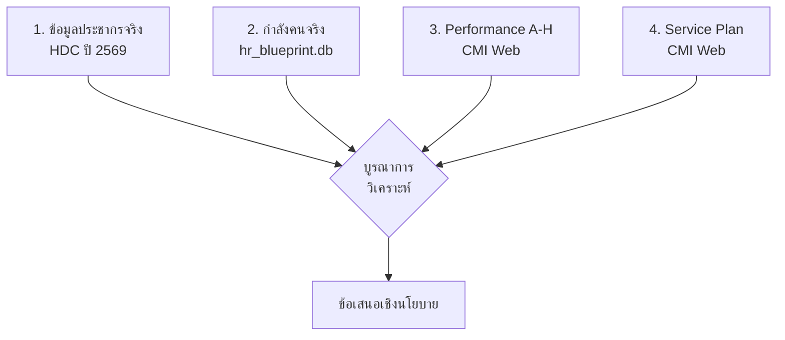
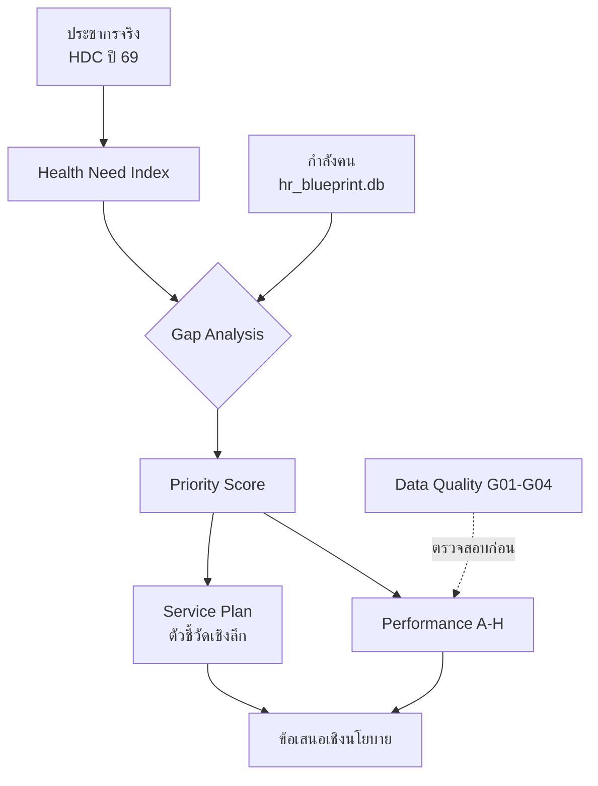

# 📊 รายงานวิเคราะห์ตัวชี้วัดสุขภาพ — เขตสุขภาพที่ 1
## Health Metrics Analysis Report — Regional Health Area 1  
## ฉบับปรับปรุงครั้งที่ 3 (เพิ่ม Service Plan + ข้อมูลจริง HDC)

**วันที่จัดทำ:** 24 มีนาคม 2569  
**จัดทำโดย:** Let's Star Shine : HR blueprint

**แหล่งข้อมูล:**
| แหล่ง | URL/Path | สถานะ |
|:---|:---|:---:|
| HDC ประชากร ปี 69 | [hdc.moph.go.th](https://hdc.moph.go.th/center/public/main) | ✅ ข้อมูลจริง |
| ระบบ CMI — Performance A-H | [cmi.maewanghospital.go.th](https://cmi.maewanghospital.go.th/web/index.php?r=report%2Fanalysis) | ✅ ข้อมูลจริง |
| ระบบ CMI — Service Plan | [cmi.maewanghospital.go.th/service](https://cmi.maewanghospital.go.th/web/index.php?r=service%2Findex) | ✅ ข้อมูลจริง |
| `hr_blueprint.db` — อัตรากำลัง | [hr_blueprint.db](file:///C:/HR_blueprint/hr_blueprint_dashboard/hr_blueprint.db) | ✅ ข้อมูลจริง |
| `hr_blueprint.db` — Population/Workload/Disease | Mock Data จาก `seed_db.py` | ⚠️ จำลอง |
| Data Dictionary | [DATA_DICTIONARY.md](file:///C:/HR_blueprint/hr_blueprint_dashboard/API/DATA_DICTIONARY.md) | ✅ อ้างอิง |
| API Catalog | [ALL_API_LINKS.txt](file:///C:/HR_blueprint/hr_blueprint_dashboard/API/ALL_API_LINKS.txt) | ✅ อ้างอิง |

---

## 1. สรุปผู้บริหาร (Executive Summary)

รายงานฉบับนี้วิเคราะห์ **รพ.ระดับ A จำนวน 8 แห่ง** ในเขตสุขภาพที่ 1 ผ่าน **4 มิติ**:



> [!IMPORTANT]
> - **ข้อมูลจริง:** ประชากร (HDC), อัตรากำลัง (hr_blueprint.db), Performance A-H (CMI), Service Plan (CMI)
> - **ข้อมูลจำลอง:** HNI calculation ใช้ Mock Data สำหรับ Chronic/Mental — ต้องนำเข้าข้อมูลจริงจาก HDC

---

## 2. ข้อมูลประชากร ปี 2569 — ข้อมูลจริงจาก HDC

> **แหล่ง:** [HDC — ประชากรจำแนกเพศ กลุ่มอายุรายปี](https://hdc.moph.go.th/center/public/standard-report-detail/db4e8d42e1234a75bd03d430c31feb2f)

| จังหวัด | ชาย | หญิง | **รวม** |
|:---|---:|---:|---:|
| **เชียงใหม่** | 566,320 | 604,374 | **1,170,694** |
| **เชียงราย** | 430,935 | 453,202 | **884,137** |
| **ลำปาง** | 240,205 | 260,971 | **501,176** |
| **น่าน** | 172,461 | 177,885 | **350,346** |
| **พะเยา** | 169,109 | 180,969 | **350,078** |
| **ลำพูน** | 162,912 | 174,541 | **337,453** |
| **แพร่** | 150,121 | 165,542 | **315,663** |
| **แม่ฮ่องสอน** | 89,933 | 89,950 | **179,883** |
| **รวมเขตสุขภาพที่ 1** | **1,981,996** | **2,107,434** | **4,089,430** |

> [!NOTE]
> ข้อมูลนี้เป็น **ข้อมูลจริง** จาก HDC กระทรวงสาธารณสุข ปีงบประมาณ 2569 สามารถใช้แทน Mock Data ในตาราง `population_data` ของ `hr_blueprint.db` ได้ทันที

---

## 3. กำลังคน — แยกรายสาขาความเชี่ยวชาญ

> **แหล่ง:** `hr_blueprint.db` → ข้อมูลจริง

### 3.1 แพทย์ (Doctors) — แยกตามสาขา

| โรงพยาบาล | นายแพทย์ | นักเทคนิค กพ. | นักรังสี กพ. | แพทย์แผนไทย | อื่นๆ | **รวม** | FTE |
|:---|---:|---:|---:|---:|---:|---:|:---:|
| **รพศ.นครพิงค์** | 274 | 43 | 22 | 4 | 27 | **370** | N/A |
| **รพศ.เชียงรายฯ** | 256 | 38 | 25 | 6 | 26 | **351** | N/A |
| **รพท.ลำปาง** | 238 | 47 | 17 | 7 | 30 | **339** | N/A |
| **รพท.น่าน** | 119 | 34 | 11 | 5 | 17 | **186** | N/A |
| **รพท.แพร่** | 123 | 25 | 4 | 7 | 15 | **174** | N/A |
| **รพท.ลำพูน** | 102 | 22 | 6 | 5 | 23 | **158** | N/A |
| **รพท.พะเยา** | 72 | 19 | 7 | 4 | 20 | **122** | N/A |
| **รพท.เชียงคำ** | 41 | 13 | 6 | 2 | 10 | **72** | N/A |

### 3.2 พยาบาล (Nurses) — แยกตามสาขา

| โรงพยาบาล | พยาบาลวิชาชีพ | ผู้ช่วย พบ. | พบ./สาธารณสุข | เทคนิค | ช่วยการ พบ. | **รวม** | FTE |
|:---|---:|---:|---:|---:|---:|---:|:---:|
| **รพศ.เชียงรายฯ** | 1,062 | 93 | 27 | — | 7 | **1,189** | N/A |
| **รพท.ลำปาง** | 905 | 50 | 85 | 3 | — | **1,043** | N/A |
| **รพศ.นครพิงค์** | 842 | 127 | 36 | 1 | — | **1,006** | N/A |
| **รพท.น่าน** | 624 | 104 | 9 | — | 5 | **742** | N/A |
| **รพท.แพร่** | 520 | 85 | 13 | — | 3 | **621** | N/A |
| **รพท.ลำพูน** | 482 | 66 | 1 | — | 10 | **559** | N/A |
| **รพท.พะเยา** | 399 | 44 | 1 | 5 | — | **449** | N/A |
| **รพท.เชียงคำ** | 249 | 16 | 3 | 1 | — | **269** | N/A |

### 3.3 เภสัชกร (Pharmacists)

| โรงพยาบาล | เภสัชกร | จพ.เภสัชกรรม | พนักงาน | **รวม** | FTE |
|:---|---:|---:|---:|---:|:---:|
| **รพท.ลำปาง** | 78 | 33 | 2 | **113** | N/A |
| **รพศ.เชียงรายฯ** | 74 | 22 | 1 | **97** | N/A |
| **รพศ.นครพิงค์** | 62 | 27 | 1 | **90** | N/A |
| **รพท.น่าน** | 48 | 21 | 8 | **77** | N/A |
| **รพท.แพร่** | 50 | 22 | 2 | **74** | N/A |
| **รพท.ลำพูน** | 47 | 24 | 1 | **72** | N/A |
| **รพท.พะเยา** | 45 | 16 | 3 | **64** | N/A |
| **รพท.เชียงคำ** | 24 | 14 | 7 | **45** | N/A |

---

## 4. Health Need Index (HNI) — สูตรและน้ำหนัก

| องค์ประกอบ | สูตร | น้ำหนัก | เหตุผลเชิงระบาดวิทยา |
|:---|:---|:---:|:---|
| **Elderly Rate** | `pop_60+ / pop_total × 100` | **40%** | ค่า RW เฉลี่ยสูงกว่าวัยทำงาน ~2.5× |
| **Chronic Rate** | `prevalence / pop_total × 100` | **40%** | ภาระ NCD Follow-up ต่อเนื่อง |
| **Mental Risk** | `mental_visits / pop_total × 100` | **20%** | ต้องการบุคลากรเฉพาะทาง |

```
HNI = [ (Elderly_Norm × 0.40) + (Chronic_Norm × 0.40) + (Mental_Norm × 0.20) ] × 100
```

> [!WARNING]
> HNI ยังใช้ **Mock Data** สำหรับ Chronic/Mental → ค่าเป็นเพียงตัวอย่าง ข้อมูลจริงสามารถดึงจาก HDC → โรคไม่ติดต่อ / สุขภาพจิต

---

## 5. ดัชนีชี้วัด Performance A-H — คำอธิบายถูกต้อง

> **แหล่ง:** [CMI Analysis](https://cmi.maewanghospital.go.th/web/index.php?r=report%2Fanalysis)

### หมวด A: ภาพรวมคุณภาพ — 17 ตัวชี้วัด | ค่าน้อย = ดี ✅

| รหัส | ตัวชี้วัด | ค่าน้อย=ดี? |
|:---|:---|:---:|
| A01 | Crude Death Rate | ✅ |
| A02 | Land Transport Accident Mortality | ✅ |
| A03 | อัตราตายโรคมะเร็ง | ✅ |
| A04 | AMI Case Fatality Rate | ✅ |
| A05 | Dengue Case Fatality Rate | ✅ |
| A06 | HIV Case Fatality Rate | ✅ |
| A07 | Pneumonia 0-5 yr Fatality Rate | ✅ |
| A08 | Re-Admission Rate 28 วัน | ✅ |
| A09 | Septicemia Mortality Rate | ✅ |
| A10 | Craniotomy Mortality Rate | ✅ |
| A11 | Acute Stroke Mortality Rate | ✅ |
| A12 | Upper GI Hemorrhage Mortality | ✅ |
| A13 | วันนอนเฉลี่ยผู้สูงอายุผ่าตัดไส้ติ่ง (ไม่อักเสบ) | ✅ |
| A14 | Hypokalaemia Rate | ✅ |
| A15 | Hyponatraemia Rate | ✅ |
| A16-17 | Re-admission 28 วันโรคเดิม | ✅ |

**ข้อมูลจริง A01 (ปี 2569):**

| โรงพยาบาล | เสียชีวิต | ผป.ในทั้งหมด | **ร้อยละ** |
|:---|---:|---:|---:|
| นครพิงค์ | 700 | 24,092 | **2.91%** ← ต่ำสุด (ดีที่สุด) |
| เชียงรายฯ | 659 | 20,052 | **3.29%** |
| ลำปาง | 725 | 21,708 | **3.34%** ← สูงสุด |

---

### หมวด B: การดูแลแม่และเด็ก — 7 ตัวชี้วัด | ค่าน้อย = ดี ✅ (ยกเว้น B06)

| รหัส | ตัวชี้วัด | ค่าน้อย=ดี? | หมายเหตุ |
|:---|:---|:---:|:---|
| B01 | Maternal Mortality Rate | ✅ | SDG < 70/แสน |
| B02 | Early Neonatal Mortality | ✅ | |
| B03 | Stillbirth Rate | ✅ | |
| B04 | Birth Asphyxia Rate | ✅ | |
| B05 | Low Birth Weight Rate | ✅ | เป้า < 7% |
| B06 | **Cesarean Section Rate** | ⚖️ | WHO 10-15%; สูงเกิน = Over-intervention |
| B07 | Perineal Laceration Rate | ✅ | |

---

### หมวด C: ศักยภาพ รพ. — 14 ตัวชี้วัด | ส่วนใหญ่ค่ามาก = ดี ✅

| รหัส | ตัวชี้วัด | ค่ามาก=ดี? | หมายเหตุ |
|:---|:---|:---:|:---|
| C01 | Average RW | ✅ | สูง = รักษาโรคซับซ้อนได้ |
| C02 | **CMI** (Average Adjusted RW) | ✅ | ดัชนีศักยภาพหลัก |
| C03 | อัตรา ผป.มีความซับซ้อน | ✅ | |
| C04 | อัตราตาย ผป.ซับซ้อน | ❌ น้อยดี | |
| C05 | ค่ารักษา/AdjRW | ⚖️ | ต่ำ = Cost-effective |
| C06 | ผป. AdjRW > 4 | ✅ | Super Complex |
| C07 | ผป. AdjRW < 0.5 | ❌ มากไม่ดี | เคสเบาเกินไป |
| C10-11 | CMI กลุ่ม OR / Non-OR | ✅ | |
| C12-13 | CMI (ตัด Delivery/COVID) | ✅ | |
| C14 | LOS (ตัด Isolate) | ❌ น้อยดี | |

---

### หมวด D: ประสิทธิภาพ รพ. — 6 ตัวชี้วัด | ต้องเทียบ Benchmark

| รหัส | ตัวชี้วัด | การตีความ |
|:---|:---|:---|
| D01 | Bed Occupancy Rate | 80-85% ดี; > 90% = Overload |
| D02 | Bed Turnover Rate | **สูง = ดี** |
| D03 | วันนอนจริง/มาตรฐาน | **ใกล้ 1.0 = ดี** |
| D04 | Same Day Case Rate | **สูง = ดี** |
| D05 | Same Day Surgery Rate | **สูง = ดี** |
| D06 | %วันนอนเกินเกณฑ์ | **น้อย = ดี** |

---

### หมวด E: ความเป็นธรรม — 3 ตัวชี้วัด | ค่าใกล้ 1.0 = เป็นธรรม

| รหัส | ตัวชี้วัด | การตีความ |
|:---|:---|:---|
| E01 | RW: สิทธิ์อื่น ÷ ข้าราชการ | ใกล้ 1.0 = เป็นธรรม |
| E02 | LOS: สิทธิ์อื่น ÷ ข้าราชการ | ใกล้ 1.0 = เป็นธรรม |
| E03 | ค่ารักษา/AdjRW: สิทธิ์อื่น ÷ ข้าราชการ | ใกล้ 1.0 = เป็นธรรม |

---

### หมวด F: ประสิทธิภาพการส่งต่อ — 12 ตัวชี้วัด

| รหัส | ตัวชี้วัด | การตีความ |
|:---|:---|:---|
| F01 | ผป.ส่งต่อรับเข้า | สูง = เป็น Hub (ปกติสำหรับ รพศ.) |
| F02 | RW ผป.รับเข้า | **สูง = ดี** รับเคสยาก |
| F05 | ผป.ส่งต่อส่งออก | **น้อย = ดี** สำหรับ รพศ. |
| F09 | RW รับเข้า ÷ RW ส่งออก | **> 1.0 = ดี** |
| F10 | %ส่งออกไป มช. | **น้อย = ดี** พึ่งตนเองได้ |
| F11 | %ส่งออกนอกเขต 1 | **น้อย = ดี** |
| F12 | %ส่งออกไปเอกชน | **น้อย = ดี** ลด Leakage |

---

### หมวด G: คุณภาพข้อมูล — 4 ตัวชี้วัด | ค่าน้อย = ดี ✅

| รหัส | ตัวชี้วัด | ค่าน้อย=ดี? |
|:---|:---|:---:|
| G01 | %AdjRW = 0 | ✅ |
| G02 | %Pdx Ill-Defined | ✅ |
| G03 | %Pdx Ill-Defined (ผู้เสียชีวิต) | ✅ |
| G04 | %ICD ด้อยคุณภาพ | ✅ |

> [!CAUTION]
> ถ้า G สูง → ข้อมูล A-F ทั้งหมดไม่น่าเชื่อถือ **ต้องแก้คุณภาพข้อมูลก่อนวิเคราะห์**

---

### หมวด H: ผู้ป่วยไม่ใช่สัญชาติไทย — 2 ตัวชี้วัด | เป็นบริบท ไม่ใช่ดี/เสีย

| รหัส | ตัวชี้วัด | การตีความ |
|:---|:---|:---|
| H01 | %ผป.ไม่ใช่สัญชาติไทย | สูง = ภาระสูง (ชายแดน) |
| H02 | %วันนอน ผป.ไม่ใช่สัญชาติไทย | สูง = ใช้ทรัพยากรมาก |

---

## 6. ดัชนีชี้วัดราย Service Plan — ตัวชี้วัดเชิงลึกรายสาขา (ใหม่)

> **แหล่ง:** [CMI Service Plan](https://cmi.maewanghospital.go.th/web/index.php?r=service%2Findex)

ข้อมูล Service Plan ลงลึกกว่า Performance A-H โดยแยกเป็น **26 กลุ่มสาขา** รวม **200+ ตัวชี้วัด** ดังนี้:

### 6.1 สาขาหัวใจและหลอดเลือด — 14 ตัวชี้วัด

| รหัส | ตัวชี้วัด | ค่าน้อย=ดี? | หมายเหตุ |
|:---|:---|:---:|:---|
| **DH0101** | %ตาย STEMI | ✅ | ตัวชี้วัดหลัก — เกณฑ์ < 12% |
| DH0102 | อัตราตาย AMI ทุกประเภท | ✅ | |
| DH0110 | %STEMI ได้รับ PPCI/Thrombolytic | ❌ **สูง=ดี** | ยิ่งเข้าถึงการรักษาเร็ว |
| DH0111 | LOS เฉลี่ย AMI | ✅ | สั้น = ฟื้นตัวเร็ว |
| DH0114 | Readmit AMI 28 วัน | ✅ | |
| DH0115 | %ตาย NSTE-ACS | ✅ | |
| DH0117 | อัตราตายหัวใจล้มเหลว | ✅ | |
| DH0201 | อัตราตาย CABG | ✅ | |
| DH0204 | %หัวใจล้มเหลวได้ Echo | ❌ **สูง=ดี** | Process indicator |
| DH0205 | %STEMI ได้เปิดหลอดเลือด | ❌ **สูง=ดี** | |

**ข้อมูลจริง DH0101 (STEMI Mortality ปี 2569):**

| โรงพยาบาล | เสียชีวิต | ผป.ทั้งหมด | **ร้อยละ** | ผ่านเกณฑ์? |
|:---|---:|---:|---:|:---:|
| เชียงรายฯ | 12 | 111 | **10.81%** | ✅ < 12% |
| นครพิงค์ | 16 | 139 | **11.51%** | ✅ ใกล้เกณฑ์ |
| ลำปาง | 13 | 101 | **12.87%** | ❌ เกินเกณฑ์ |

> **การตีความ:** ลำปางมี STEMI Mortality เกิน 12% → ควรเจาะลึกว่าเป็นปัญหา Door-to-Balloon Time, ระบบ STEMI Fast Track, หรือ Case Severity

---

### 6.2 สาขาอุบัติเหตุ — 7 ตัวชี้วัด

| รหัส | ตัวชี้วัด | ค่าน้อย=ดี? |
|:---|:---|:---:|
| BN0001 | อัตราตาย Burn | ✅ |
| DN0301 | %ตายบาดเจ็บศีรษะ (Brain Injury) | ✅ |
| DN0302 | %ตายภายใน 48 ชม. | ✅ |
| DN0303 | Craniotomy Mortality Rate | ✅ |
| DN0305-306 | %ตายภายใน 24 ชม. / 30 วัน | ✅ |
| DN0307 | LOS เฉลี่ยบาดเจ็บศีรษะ | ✅ น้อย=ดี |

---

### 6.3 สาขามะเร็ง — 8 ตัวชี้วัด

| รหัส | ตัวชี้วัด | ค่าน้อย=ดี? | หมายเหตุ |
|:---|:---|:---:|:---|
| DC0401 | อัตราตายมะเร็งรวม | ✅ | |
| DC0403 | อัตราตายมะเร็งตับ | ✅ | พบมากในอีสาน+เหนือ |
| DC0404 | อัตราตายมะเร็งท่อน้ำดี | ✅ | Cholangiocarcinoma |
| DC0405 | อัตราตายมะเร็งปอด | ✅ | |
| DC0406 | อัตราตายมะเร็งเต้านม | ✅ | |
| DC0407 | อัตราตายมะเร็งปากมดลูก | ✅ | |
| DC0408 | อัตราตายมะเร็งลำไส้ใหญ่ | ✅ | |
| DC0501 | %ส่งออกมะเร็งไป มช. | ✅ น้อย=ดี | พึ่งตนเองได้ |

---

### 6.4 สาขาทารกแรกเกิด — 10 ตัวชี้วัด

| รหัส | ตัวชี้วัด | ค่าน้อย=ดี? |
|:---|:---|:---:|
| CM0202 | Perinatal Mortality | ✅ |
| CM0203 | Neonatal Mortality Rate | ✅ |
| CM0204 | อัตราขาด O₂ ทารกแรกเกิด | ✅ |
| CM0206 | อัตรา LBW < 2,500g | ✅ |
| CM0207 | อัตราตาย < 1,000g ใน 28 วัน | ✅ |
| CM0208 | อัตราตาย 1,000-1,499g ใน 28 วัน | ✅ |
| NB0101 | ผป.เด็ก 0-28 วันมีความซับซ้อน | ❌ **สูง=ดี** ศักยภาพ |

---

### 6.5 สาขาโรคหลอดเลือดสมอง (Stroke) — 18 ตัวชี้วัด

| รหัส | ตัวชี้วัด | การตีความ |
|:---|:---|:---|
| DN0100 | อัตราตาย Stroke (I60-I69) | น้อย=ดี |
| DN0101 | อัตราตาย Stroke (I60-I67) | น้อย=ดี |
| DN0108 | Readmit 28 วัน Stroke | น้อย=ดี |
| DN0109 | LOS เฉลี่ย Stroke | น้อย=ดี |
| DN0120 | อัตราปอดบวมใน Stroke | น้อย=ดี (ภาวะแทรกซ้อน) |
| DN0121 | อัตรา UTI ใน Stroke | น้อย=ดี |
| DN0122 | อัตราแผลกดทับใน Stroke | น้อย=ดี |
| DN0132 | %Hemorrhagic Stroke ผ่าตัด ≤90 นาที | **สูง=ดี** |
| DN0142 | %Ischemic Stroke ได้ rtPA | **สูง=ดี** |

---

### 6.6 สาขาศัลยกรรม — 10 ตัวชี้วัด

| รหัส | ตัวชี้วัด | การตีความ |
|:---|:---|:---|
| DG0201 | %ไส้ติ่งทะลุ | **น้อย=ดี** ตรวจพบเร็ว |
| DG0202 | Fatality Rate ไส้ติ่งอักเสบ | น้อย=ดี |
| DG0205 | %ตายปวดท้องเฉียบพลัน | น้อย=ดี |
| DG0206 | %ตาย Acute Limb Ischemia | น้อย=ดี |
| DG02061 | %ถูกตัดขา ≥ ข้อเท้า | น้อย=ดี |
| LC0001 | Readmit หลังผ่าตัดนิ่ว MIS | น้อย=ดี |

---

### 6.7 สาขาอายุรกรรม — 5 ตัวชี้วัด

| รหัส | ตัวชี้วัด | ค่าน้อย=ดี? |
|:---|:---|:---:|
| CI0101 | อัตราตาย Sepsis | ✅ |
| CI0102 | อัตราตาย Severe Sepsis | ✅ |
| CI01011 | LOS Sepsis | ✅ |
| CI01021 | LOS Severe Sepsis | ✅ |
| DR0101 | อัตราตายปอดบวม | ✅ |

---

### 6.8 สาขากุมารเวชกรรม — 17 ตัวชี้วัด

| รหัส | ตัวชี้วัด | การตีความ |
|:---|:---|:---|
| PE0101 | อัตราตายเด็ก 1 เดือน - 5 ปี | น้อย=ดี |
| PE0102 | อัตราตายปอดบวม เด็ก 1 เดือน-5 ปี | น้อย=ดี |
| PE0103 | %เด็กที่มีความซับซ้อน | **สูง=ดี** ศักยภาพ |
| PECMI | CMI เด็ก 1 เดือน-15 ปี | **สูง=ดี** ศักยภาพ |

---

### 6.9 สาขาออร์โธปิดิกส์ — 20+ ตัวชี้วัด

| รหัส | ตัวชี้วัด | การตีความ |
|:---|:---|:---|
| DO0210 | %Open fracture ผ่าตัดภายใน 6 ชม. | **สูง=ดี** |
| DO0211 | %Hip fracture ≥50 ปี ผ่าตัด ≤72 ชม. | **สูง=ดี** |
| DO0205 | อัตราติดเชื้อแผลผ่าตัดข้อสะโพก | น้อย=ดี |
| DO0304 | อัตราติดเชื้อแผลผ่าตัดข้อเข่า | น้อย=ดี |
| ORTH01 | %Refracture หลัง Hip Fracture | น้อย=ดี |

---

### 6.10 สาขาอื่นๆ — สรุปรวม

| สาขา | ตัวชี้วัดหลัก | การตีความ |
|:---|:---|:---|
| **สูติกรรม** (CM01xx) | Preterm Rate, C/S Readmit, ตกเลือดหลังคลอด | น้อย=ดี |
| **ตา** (EYE0101) | %ผ่าตัดต้อกระจกผู้สูงอายุ | **สูง=ดี** เข้าถึงบริการ |
| **สุขภาพจิต** (PS0001) | อัตราฆ่าตัวตายสำเร็จ (Admit) | น้อย=ดี |
| **COPD/Asthma** (DR03-04) | Readmit, อัตราตาย COPD/Asthma | น้อย=ดี |
| **ผู้พิการ** (DS0101) | %ผป.ใช้สิทธิผู้พิการ | บริบท |
| **Pressure Ulcer** (CG0103) | ความชุกแผลกดทับ | น้อย=ดี |
| **UGIH** (DG01xx) | อัตราตาย Upper GI Hemorrhage | น้อย=ดี |
| **HIV** (DC03xx) | อัตราตาย HIV / อัตรา Admit HIV | น้อย=ดี |
| **Intermediate Care** (IM0x) | %ส่งกลับ / %Readmit | สูง=ส่งกลับมาก ดี; Readmit น้อย=ดี |
| **Hip Fracture ผู้สูงอายุ** (FX60xx) | %ผ่าตัดใน 48 ชม., อัตราตาย 30 วัน | ผ่าตัดเร็ว=ดี, ตาย น้อย=ดี |
| **MIS** (MIS01) | %ผ่าตัดนิ่ว/ถุงน้ำดี แบบ MIS | **สูง=ดี** |
| **ODS** (ODS01-02) | %One Day Surgery | **สูง=ดี** |
| **Ventilator** (VT0101) | %ผป.ใช้ Ventilator | บริบท (สูง=เคสหนัก) |
| **กายภาพ** (RH0101) | %Stroke ได้ PT | **สูง=ดี** |
| **ENT** (ENT001) | อัตราทารกเสี่ยงสูญเสียการได้ยิน | น้อย=ดี |
| **ศัลยกรรมตกแต่ง** (DE12xx) | %ผ่าตัดปากแหว่ง ≤6 เดือน | **สูง=ดี** เข้าถึงเร็ว |
| **NCD** (DC0107) | อัตราถูกตัดขาจาก DM | น้อย=ดี |

---

## 7. กรอบการวิเคราะห์เชิงบูรณาการ (Analytical Framework)

### 7.1 แนวคิด 4 มิติ (ปรับปรุงจาก 3 มิติ)



### 7.2 ขั้นตอนการวิเคราะห์สำหรับผู้บริหาร

| ขั้นตอน | ทำอะไร | ดูตัวชี้วัดอะไร |
|:---:|:---|:---|
| **1** | ตรวจสอบคุณภาพข้อมูลก่อน | G01-G04 → ถ้าสูง ข้อมูลไม่น่าเชื่อถือ |
| **2** | ดูภาระสุขภาพ | HNI (ประชากร + ผู้สูงอายุ + NCD + จิตเวช) |
| **3** | เทียบกำลังคน | Headcount แพทย์/พยาบาล/เภสัชกร |
| **4** | ดูคุณภาพภาพรวม | A01-A17 → Crude Death Rate, Readmit |
| **5** | เจาะลึกตาม Specialty | Service Plan DH/DN/CM/PE ฯลฯ |
| **6** | ดูประสิทธิภาพ | D01-D06 → Bed Occupancy, Same Day |
| **7** | ดูความเป็นธรรม | E01-E03 → เปรียบเทียบสิทธิ์ |
| **8** | ดูการส่งต่อ | F10-F12 → Leakage นอกเขต |

---

### 7.3 ตารางเปรียบเทียบ — ข้อมูลจริง

| โรงพยาบาล | ประชากร (จว.) | แพทย์ | พยาบาล | เภสัช | A01 (%) | DH0101 (%) | สถานะ |
|:---|---:|---:|---:|---:|---:|---:|:---|
| **รพศ.นครพิงค์** | 1,170,694 | 370 | 1,006 | 90 | **2.91** | **11.51** | 🟡 CDR ดี / STEMI ใกล้เกณฑ์ |
| **รพศ.เชียงรายฯ** | 884,137 | 351 | 1,189 | 97 | **3.29** | **10.81** | 🟢 STEMI ดี / กำลังคนเพียงพอ |
| **รพท.ลำปาง** | 501,176 | 339 | 1,043 | 113 | **3.34** | **12.87** | 🔴 CDR+STEMI สูงสุด ต้องเจาะลึก |
| **รพท.น่าน** | 350,346 | 186 | 742 | 77 | — | — | 🟡 กำลังคนปานกลาง |
| **รพท.พะเยา** | 350,078 | 122 | 449 | 64 | — | — | 🔴 กำลังคนน้อยที่สุดในกลุ่ม |
| **รพท.ลำพูน** | 337,453 | 158 | 559 | 72 | — | — | 🟡 สมดุลพอใช้ |
| **รพท.แพร่** | 315,663 | 174 | 621 | 74 | — | — | 🟡 ต้องเฝ้าระวัง |
| **รพท.เชียงคำ** | — | 72 | 269 | 45 | — | — | 🟡 รพ.ขนาดเล็ก |

---

## 8. ข้อเสนอเชิงวิเคราะห์ (Analytical Recommendations)

### 8.1 จัดสรรอัตรากำลัง

| ลำดับ | โรงพยาบาล | ข้อเสนอ | เหตุผล |
|:---:|:---|:---|:---|
| 1 | **รพท.พะเยา** | 🔴 เพิ่มกำลังคนเร่งด่วน | ประชากร 350K แต่นายแพทย์ 72 คน, พยาบาล 449 คน |
| 2 | **รพท.น่าน** | 🔴 เพิ่มแพทย์เฉพาะทาง | ประชากร 350K, นายแพทย์ 119 คน |
| 3 | **รพท.ลำปาง** | 🟡 ทบทวน Process Quality | กำลังคนมากแต่ A01+DH0101 สูงที่สุด |
| 4 | **รพศ.เชียงรายฯ** | 🟢 รักษาระดับ | กำลังคน+Performance ดี |

### 8.2 ปรับปรุงคุณภาพ

1. **ลำปาง:** STEMI Mortality 12.87% (เกิน 12%) → ทบทวน STEMI Fast Track, DTN time, Cath Lab readiness
2. **ตรวจ G01-G04 ก่อน:** ถ้า Data Quality ต่ำ → แก้ ICD coding ก่อนตัดสินใจ
3. **ดู F10-F12:** ถ้าส่งออกไป มช./นอกเขต/เอกชนมาก → ต้องเพิ่มศักยภาพ CMI ในเขต

### 8.3 ข้อมูลที่ควรนำเข้าเพิ่มเติม

| ข้อมูล | แหล่ง | วิธีนำเข้า |
|:---|:---|:---|
| ผู้สูงอายุรายจังหวัด | HDC → ข้อมูลทั่วไป → ประชากร | กรอง 60+ จาก Age pyramid |
| NCD รายจังหวัด | HDC → โรคไม่ติดต่อ | เบาหวาน+ความดัน |
| สุขภาพจิตรายจังหวัด | HDC → สถานะสุขภาพ | จิตเวช/ฆ่าตัวตาย |
| Performance A01-A17 ทุก รพ. | CMI Web → A01 กรอง Level A | ดึงด้วย Scraper |
| Service Plan ทุกสาขา | CMI Web → Service Index | ดึงด้วย Scraper |

---

## 9. ทางเลือกค่าน้ำหนัก HNI

| รูปแบบ | Elderly | Chronic | Mental | เหมาะกับ |
|:---|:---:|:---:|:---:|:---|
| **ปัจจุบัน** | 40% | 40% | 20% | เน้นผู้สูงอายุ + NCD เท่ากัน |
| **WHO Burden** | 30% | 30% | 40% | เน้นสุขภาพจิตตาม WHO |
| **Aging Focus** | 50% | 30% | 20% | สังคมผู้สูงอายุ |
| **NCD Focus** | 25% | 50% | 25% | เน้นภาระโรคเรื้อรัง |

---

*จัดทำโดย: Health Data Scientist — HR Blueprint Dashboard Analysis System*  
*ข้อมูลจริงจาก: HDC กระทรวงสาธารณสุข + ระบบ CMI เขตสุขภาพที่ 1*  
*วิเคราะห์: 24 มีนาคม 2569*
