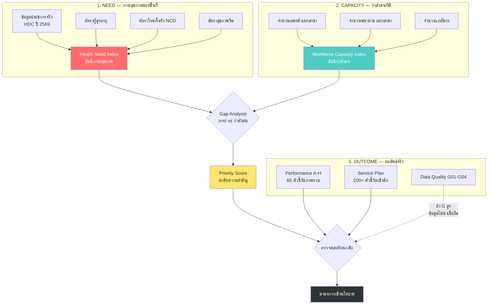
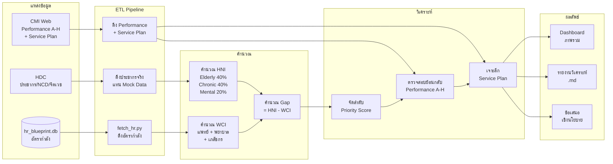
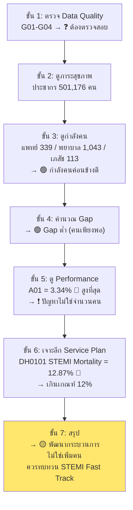
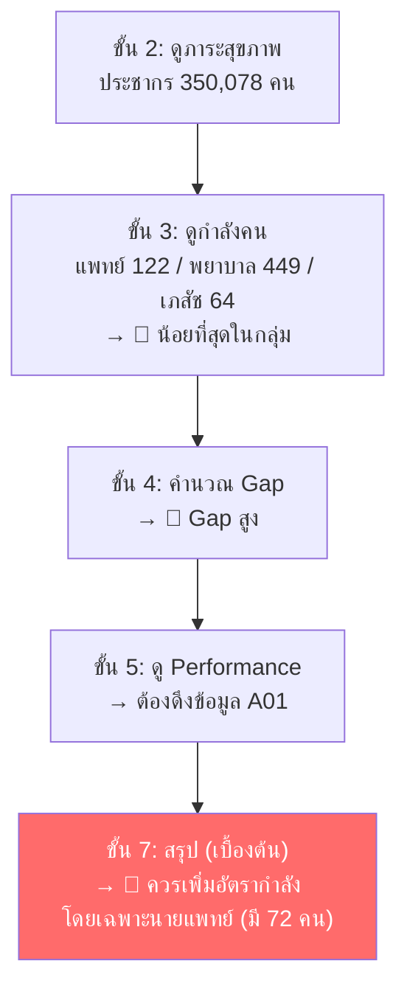
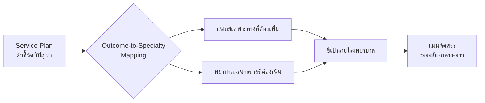

# 📋 แนวทางการบริหารจัดการอัตรากำลังเชิงคุณภาพ
## Recommendation Guide: Evidence-Based Workforce Management Model
### เขตสุขภาพที่ 1 — เสนอผู้ตรวจราชการกระทรวงสาธารณสุข

**วันที่:** 24 มีนาคม 2569  
**จัดทำโดย:** Let's Star Shine : HR blueprint

---

## 1. หลักการคิด (Conceptual Framework)

### ปัญหาเดิม
การจัดสรรอัตรากำลังแบบเดิมใช้ **"FTE"** และ **"กรอบตาม SAP"** เป็นหลัก สำหรับ รพ.ศูนย์/รพ.ทั่วไป และใช้จำนวนแพทย์ทั่วไปสำหรับ รพ.ชุมชน ซึ่ง:
- ❌ ไม่สะท้อนภาระโรคที่แท้จริงของพื้นที่ (Dynamic Need)
- ❌ ไม่คำนึงถึงผลลัพธ์การรักษา (Outcome)
- ❌ ไม่เชื่อมโยงระหว่าง "ศักยภาพเฉพาะทาง" กับ "คุณภาพ"

### โมเดลใหม่: **"Need-Capacity-Outcome" Model (NCO Model)**



> **หลักการสำคัญ:** ไม่ตัดสินใจจากตัวเลขด้านเดียว ต้อง **"สามเหลี่ยมยืนยัน"** ทุกครั้ง
> 1. ภาระสูง + คนน้อย → ดู Outcome ยืนยัน
> 2. Outcome แย่ + คนพอ → ดู Process ว่าปัญหาอยู่ที่ไหน
> 3. ข้อมูลไม่ดี (G สูง) → แก้คุณภาพข้อมูลก่อนตัดสินใจ

---

## 2. FLOW การไหลของข้อมูล (Data Flow)



---

## 3. ขั้นตอนการวิเคราะห์ — แนวปฏิบัติ 7 ขั้น

### ขั้นที่ 1: ตรวจสอบคุณภาพข้อมูลก่อน ⚠️

| ทำอะไร | ดูตัวชี้วัด | เกณฑ์ | ถ้าไม่ผ่าน |
|:---|:---|:---|:---|
| ตรวจ ICD Coding | G01-G04 | G02 < 5% | **หยุด — แก้ข้อมูลก่อน** |

> **เหตุผล:** ถ้ารหัสโรค Ill-Defined สูง หรือ AdjRW = 0 มาก → ทุกตัวชี้วัดที่คำนวณจาก DRG จะเบี่ยงเบน → ตัดสินใจผิดได้

---

### ขั้นที่ 2: วิเคราะห์ภาระสุขภาพ (NEED)

| ทำอะไร | ข้อมูล | สูตร |
|:---|:---|:---|
| คำนวณ HNI | ประชากร + ผู้สูงอายุ + NCD + จิตเวช | HNI = (Elderly × 40%) + (Chronic × 40%) + (Mental × 20%) |
| เรียงลำดับ | HNI สูง → ภาระมาก | จัดอันดับจากมากไปน้อย |

**ข้อมูลประชากรจริง (HDC ปี 2569):**

| จังหวัด | ประชากร | รพ.แม่ข่าย |
|:---|---:|:---|
| เชียงใหม่ | 1,170,694 | รพศ.นครพิงค์ |
| เชียงราย | 884,137 | รพศ.เชียงรายประชานุเคราะห์ |
| ลำปาง | 501,176 | รพท.ลำปาง |
| น่าน | 350,346 | รพท.น่าน |
| พะเยา | 350,078 | รพท.พะเยา |
| ลำพูน | 337,453 | รพท.ลำพูน |
| แพร่ | 315,663 | รพท.แพร่ |
| แม่ฮ่องสอน | 179,883 | — |

---

### ขั้นที่ 3: วิเคราะห์กำลังคน (CAPACITY)

| ทำอะไร | ข้อมูล | แหล่ง |
|:---|:---|:---|
| นับ Headcount แยกสาขา | แพทย์ / พยาบาล / เภสัชกร | hr_blueprint.db |
| คำนวณ WCI | ถ่วงน้ำหนักตามวิชาชีพ | ETL Pipeline |

---

### ขั้นที่ 4: วิเคราะห์ GAP (ภาระ vs กำลังคน)

```
Gap Score = HNI - WCI (Normalized)
```

| สถานะ | ความหมาย | มาตรการ |
|:---|:---|:---|
| 🔴 Gap สูง | ภาระมาก + คนน้อย | **เพิ่มอัตรากำลังเร่งด่วน** |
| 🟡 Gap ปานกลาง | ต้องเฝ้าระวัง | ดู Performance ยืนยัน |
| 🟢 Gap ต่ำ | สมดุล | รักษาระดับ + โฟกัส Quality |

---

### ขั้นที่ 5: ตรวจสอบย้อนกลับด้วย Performance A-H (OUTCOME)

| ทำอะไร | ดูตัวชี้วัด | ตัวอย่าง |
|:---|:---|:---|
| คุณภาพภาพรวม | **A01** Crude Death Rate | ลำปาง 3.34% (สูงสุด) |
| การดูแลแม่-เด็ก | **B01-B07** Maternal/Neonatal | |
| ศักยภาพ | **C02** CMI | สูง = ศักยภาพสูง |
| ประสิทธิภาพ | **D01** Bed Occupancy | 80-85% = ดี |
| ความเป็นธรรม | **E01-E03** Equity | ใกล้ 1.0 = เป็นธรรม |
| การส่งต่อ | **F10-F12** Leakage | น้อย = พึ่งตนเองได้ |

> **หลักการอ่าน:** ถ้า Gap สูง + A01 สูง → ยืนยันว่าขาดคนจริง → ต้องเพิ่มกำลังคน  
> ถ้า Gap ต่ำ + A01 สูง → ปัญหาไม่ใช่ "จำนวนคน" แต่เป็น "คุณภาพกระบวนการ" → ต้องพัฒนา Process

---

### ขั้นที่ 6: เจาะลึกด้วย Service Plan

| เงื่อนไข | ดูอะไร | เหตุผล |
|:---|:---|:---|
| A01 สูง | ดู DH0101 (STEMI), CI0101 (Sepsis), DN0101 (Stroke) | เจาะว่าตายจากโรคอะไร |
| B สูง | ดู CM0101 (Maternal Death), CM0206 (LBW) | ปัญหาแม่-เด็ก |
| C02 ต่ำ | ดู PECMI, Service Plan รายสาขา | ศักยภาพด้านไหนอ่อน |
| F10 สูง | ดู DC0501 (ส่งมะเร็งไป มช.) | ส่งออกโรคอะไรมากที่สุด |

---

### ขั้นที่ 7: สรุปข้อเสนอเชิงนโยบาย

| ประเภท | เงื่อนไข | มาตรการ |
|:---|:---|:---|
| **เพิ่มคน** | Gap สูง + Outcome แย่ | จัดสรรอัตรากำลังเพิ่ม |
| **พัฒนากระบวนการ** | Gap ต่ำ + Outcome แย่ | ปรับ Protocol / Fast Track |
| **แก้ข้อมูล** | G สูง | พัฒนา ICD Coding Quality |
| **เพิ่มศักยภาพ** | F10-F12 สูง | เพิ่ม CMI / ลด Referral Out |
| **รักษาระดับ** | Gap ต่ำ + Outcome ดี | Benchmark + Continuous Improvement |

---

## 4. ตัวอย่างการวิเคราะห์จริง — เขตสุขภาพที่ 1

### Case Study: รพท.ลำปาง



### Case Study: รพท.พะเยา



---

## 5. Matrix ตัดสินใจ (Decision Matrix)

|  | **Outcome ดี** (A01 ต่ำ) | **Outcome แย่** (A01 สูง) |
|:---|:---|:---|
| **Gap สูง** (คนน้อย) | ⚡ ระวัง — คุณภาพอาจลดในอนาคต → **เพิ่มคนเชิงป้องกัน** | 🔴 **วิกฤติ** — เพิ่มคนทันที + ปรับ Process |
| **Gap ต่ำ** (คนพอ) | 🟢 **ดี** — รักษาระดับ + Benchmark | 🟡 **ปัญหา Process** — ทบทวน Protocol, ไม่ใช่เพิ่มคน |

---

## 6. สรุปโมเดลเป็นภาพรวม

```
┌─────────────────────────────────────────────────────────┐
│                    NCO Model                            │
│         (Need — Capacity — Outcome)                     │
├─────────────────────────────────────────────────────────┤
│                                                         │
│  ① ตรวจคุณภาพข้อมูล (G01-G04) ← ถ้าไม่ผ่าน STOP       │
│              │                                          │
│  ② วัดภาระ (NEED)      ③ วัดกำลังคน (CAPACITY)         │
│     - ประชากร HDC          - แพทย์ แยกสาขา              │
│     - ผู้สูงอายุ           - พยาบาล แยกสาขา             │
│     - NCD                  - เภสัชกร                    │
│     - สุขภาพจิต                                         │
│              │                      │                   │
│              └───── ④ GAP ──────────┘                   │
│                      │                                  │
│  ⑤ ตรวจย้อนกลับ ← Performance A-H (65 ตัวชี้วัด)      │
│                      │                                  │
│  ⑥ เจาะลึก ← Service Plan (200+ ตัวชี้วัด)            │
│                      │                                  │
│  ⑦ ข้อเสนอเชิงนโยบาย                                   │
│     🔴 เพิ่มคน | 🟡 พัฒนา Process | 🟢 รักษาระดับ      │
│                                                         │
└─────────────────────────────────────────────────────────┘
```

---

## 7. ข้อเสนอต่อผู้ตรวจราชการ

### 7.1 มาตรการเร่งด่วน (Quick Win)

| ลำดับ | เรื่อง | ดำเนินการ |
|:---:|:---|:---|
| 1 | **นำเข้าข้อมูลจริงแทน Mock** | ใช้ข้อมูล HDC (ประชากร/NCD/จิตเวช) แทนข้อมูลจำลอง |
| 2 | **ตรวจสอบ Data Quality** ทุก รพ. | ดู G01-G04 เพื่อยืนยันความน่าเชื่อถือของข้อมูล |
| 3 | **ทบทวน STEMI Fast Track ลำปาง** | DH0101 = 12.87% เกินเกณฑ์ 12% |

### 7.2 มาตรการระยะกลาง

| ลำดับ | เรื่อง | ดำเนินการ |
|:---:|:---|:---|
| 1 | **จัดสรรอัตรากำลังตาม NCO Model** | ใช้ Gap Score + Outcome ยืนยัน |
| 2 | **พัฒนา Dashboard เชิงนโยบาย** | แสดง HNI / WCI / Performance ในหน้าจอเดียว |
| 3 | **ดึง Performance ทุก รพ. อัตโนมัติ** | สร้าง Scraper เก็บข้อมูล CMI Web + Service Plan |

### 7.3 มาตรการระยะยาว

| ลำดับ | เรื่อง | ดำเนินการ |
|:---:|:---|:---|
| 1 | **สร้างระบบ Early Warning** | ถ้า Gap เพิ่ม + Outcome ลด → แจ้งเตือนอัตโนมัติ |
| 2 | **ขยายโมเดลไปเขตอื่น** | ใช้ NCO Model กับเขตสุขภาพที่ 2-13 |
| 3 | **เชื่อม FTE จริง** | เมื่อได้ข้อมูล FTE → เพิ่มมิติ Capacity ให้แม่นยำขึ้น |

---

## 8. การชี้เป้าเฉพาะทาง — Service Plan → Subspecialty Mapping

### 8.1 หลักการ: "Outcome ชี้นำ Specialty"

> ไม่ใช่แค่ "เพิ่มคน" แต่ต้อง **"เพิ่มคนที่ใช่ ในที่ที่ใช่"**  
> โดยใช้ผลลัพธ์จาก Service Plan ชี้ว่า **สาขาใดมีปัญหา → ต้องการเฉพาะทางใด**



### 8.2 ตาราง Mapping: ตัวชี้วัดที่มีปัญหา → เฉพาะทางที่ต้องเพิ่ม

| ผลลัพธ์ที่มีปัญหา (Service Plan) | ดูตัวชี้วัด | แพทย์เฉพาะทางที่ต้องการ | พยาบาลเฉพาะทางที่ต้องการ |
|:---|:---|:---|:---|
| **STEMI Mortality สูง** | DH0101, DH0102, DH0205 | อายุรแพทย์หัวใจ (Interventional Cardiologist) | พยาบาล CCU / Cath Lab |
| **STEMI ไม่ได้ PPCI** | DH0110 | อายุรแพทย์หัวใจ + ศัลยแพทย์หัวใจ | พยาบาล Cath Lab |
| **Stroke Mortality สูง** | DN0101, DN0140, DN0150 | อายุรแพทย์ประสาท (Neurologist) | พยาบาล Stroke Unit |
| **Ischemic Stroke ไม่ได้ rtPA** | DN0142 | อายุรแพทย์ประสาท + ER Physician | พยาบาล ER / Stroke Fast Track |
| **Hemorrhagic Stroke ผ่าตัดช้า** | DN0132 | ศัลยแพทย์ประสาท (Neurosurgeon) | พยาบาลห้องผ่าตัด (OR Nurse) |
| **Craniotomy Mortality สูง** | DN0303 | ศัลยแพทย์ประสาท + วิสัญญีแพทย์ | พยาบาล Neuro ICU |
| **Sepsis Mortality สูง** | CI0101, CI0102 | อายุรแพทย์โรคติดเชื้อ (ID Physician) | พยาบาล ICU |
| **Pneumonia Mortality สูง (เด็ก)** | PE0102, A07 | กุมารแพทย์ระบบหายใจ | พยาบาล PICU / กุมารเวชกรรม |
| **Neonatal Mortality สูง** | CM0203, CM0207 | กุมารแพทย์ทารกแรกเกิด (Neonatologist) | พยาบาล NICU |
| **Maternal Mortality สูง** | CM0101, B01 | สูตินรีแพทย์ (Obstetrician) | พยาบาลห้องคลอด / OB Nurse |
| **มะเร็ง Mortality สูง** | DC0401-0408 | อายุรแพทย์มะเร็ง (Oncologist) + ศัลยแพทย์ | พยาบาลเคมีบำบัด |
| **ส่งต่อมะเร็งไป มช. มาก** | DC0501 | ศัลยแพทย์มะเร็ง + รังสีรักษาแพทย์ | พยาบาลเฉพาะทางมะเร็ง |
| **Hip Fracture ผ่าตัดช้า** | FX6003, DO0211 | ศัลยแพทย์ออร์โธปิดิกส์ + วิสัญญีแพทย์ | พยาบาลห้องผ่าตัด |
| **ไส้ติ่งทะลุสูง** | DG0201 | ศัลยแพทย์ทั่วไป | พยาบาล ER / OR |
| **Burn Mortality สูง** | BN0001 | ศัลยแพทย์ตกแต่ง (Plastic Surgeon) | พยาบาล Burn Unit |
| **อัตราฆ่าตัวตายสูง** | PS0001 | จิตแพทย์ (Psychiatrist) | พยาบาลจิตเวช |
| **Stroke ไม่ได้กายภาพ** | RH0101 | แพทย์เวชศาสตร์ฟื้นฟู (Physiatrist) | นักกายภาพบำบัด |
| **DM ถูกตัดขามาก** | DC0107 | อายุรแพทย์ต่อมไร้ท่อ + ศัลยแพทย์หลอดเลือด | พยาบาล DM Clinic / Wound Nurse |
| **UGIH Mortality สูง** | DG0100 | อายุรแพทย์ทางเดินอาหาร (GI Specialist) | พยาบาล Endoscopy Unit |
| **COPD/Asthma Readmit สูง** | DR0303, DR0402 | อายุรแพทย์ระบบทางเดินหายใจ | พยาบาล Pulmonary Clinic |
| **HIV Case Fatality สูง** | DC0301 | อายุรแพทย์โรคติดเชื้อ | พยาบาล ARV Clinic |
| **Bed Occupancy เกิน 90%** | D01 | — (ไม่ใช่เฉพาะทาง) | พยาบาลทั่วไป (Ward Nurse) |

---

## 9. ชี้เป้ารายโรงพยาบาล — แพทย์และพยาบาลเฉพาะทาง

### 9.1 ข้อมูลพื้นฐานที่มี (จาก hr_blueprint.db)

| โรงพยาบาล | ประชากร(จว.) | นายแพทย์ | ทันตแพทย์ | นักกายภาพฯ | พยาบาลวิชาชีพ | ผู้ช่วย พบ. |
|:---|---:|---:|---:|---:|---:|---:|
| **รพศ.นครพิงค์** | 1,170,694 | 274 | 31 | 16 | 842 | 127 |
| **รพศ.เชียงรายฯ** | 884,137 | 256 | 34 | 21 | 1,062 | 93 |
| **รพท.ลำปาง** | 501,176 | 238 | 28 | 18 | 905 | 50 |
| **รพท.น่าน** | 350,346 | 119 | 31 | 12 | 624 | 104 |
| **รพท.แพร่** | 315,663 | 123 | 20 | 12 | 520 | 85 |
| **รพท.พะเยา** | 350,078 | 72 | 18 | 9 | 399 | 44 |
| **รพท.ลำพูน** | 337,453 | 102 | 22 | 12 | 482 | 66 |
| **รพท.เชียงคำ** | — | 41 | 13 | 6 | 249 | 16 |

> [!NOTE]
> **ข้อจำกัด:** ฐานข้อมูลปัจจุบันบันทึกเป็น "นายแพทย์" รวม ยังไม่มีข้อมูล Subspecialty (เช่น อายุรแพทย์หัวใจ, ศัลยแพทย์ประสาท) → ต้องนำเข้าข้อมูลวุฒิเฉพาะทางจากแพทยสภา/สำนักบริหารบุคลากร

### 9.2 ชี้เป้ารายแห่ง — ข้อมูลเท่าที่ทราบ + ข้อเสนอ

---

#### 🔴 รพท.พะเยา — เร่งด่วนที่สุด

| ปัจจัย | ข้อมูล | ปัญหา |
|:---|:---|:---|
| ประชากร | 350,078 | ใกล้เคียง รพท.น่าน (350,346) |
| นายแพทย์ | **72 คน** | น้อยที่สุด ห่างจากน่าน (119) ถึง 40% |
| พยาบาลวิชาชีพ | **399 คน** | น้อยที่สุด (ครึ่งหนึ่งของนครพิงค์) |
| นักกายภาพ | **9 คน** | น้อยที่สุด |

**ข้อเสนอเฉพาะทาง:**

| ลำดับ | สาขา | แพทย์ที่ต้องเพิ่ม | พยาบาลที่ต้องเพิ่ม | เหตุผล |
|:---:|:---|:---|:---|:---|
| 1 | หัวใจ | อายุรแพทย์หัวใจ Interventional ≥ 1 | พยาบาล CCU ≥ 5 | ดู DH0101 ว่าเกินเกณฑ์? |
| 2 | ประสาท | อายุรแพทย์ประสาท ≥ 1 | พยาบาล Stroke Unit ≥ 3 | ดู DN0101, DN0142 |
| 3 | ทั่วไป | ศัลยแพทย์ทั่วไป ≥ 2 | พยาบาลห้องผ่าตัด ≥ 5 | รพท. ระดับ A ต้องผ่าตัดได้ 24 ชม. |
| 4 | ฟื้นฟู | แพทย์เวชศาสตร์ฟื้นฟู ≥ 1 | นักกายภาพ ≥ 5 | RH0101 - Stroke PT |
| 5 | จิตเวช | จิตแพทย์ ≥ 1 | พยาบาลจิตเวช ≥ 2 | PS0001 - ภาคเหนือฆ่าตัวตายสูง |

---

#### 🔴 รพท.น่าน — เร่งด่วน

| ปัจจัย | ข้อมูล | ปัญหา |
|:---|:---|:---|
| ประชากร | 350,346 | พื้นที่ห่างไกล ส่งต่อยาก |
| นายแพทย์ | **119 คน** | น้อยกว่าค่ามัธยฐาน (148.5 คน) |
| HNI (Mock) | **98.66** | สูงที่สุดในกลุ่ม |

**ข้อเสนอเฉพาะทาง:**

| ลำดับ | สาขา | แพทย์ที่ต้องเพิ่ม | พยาบาลที่ต้องเพิ่ม | เหตุผล |
|:---:|:---|:---|:---|:---|
| 1 | ออร์โธฯ | ศัลยแพทย์ออร์โธปิดิกส์ ≥ 1 | พยาบาล OR ≥ 3 | FX6003 - ผู้สูงอายุ Hip Fracture |
| 2 | มะเร็ง | ศัลยแพทย์มะเร็ง ≥ 1 | พยาบาลเคมีบำบัด ≥ 2 | DC0501 - ลดส่งต่อไป มช. |
| 3 | หัวใจ | อายุรแพทย์หัวใจ ≥ 1 | พยาบาล CCU ≥ 3 | DH0101 |
| 4 | เด็ก | กุมารแพทย์ทารกแรกเกิด ≥ 1 | พยาบาล NICU ≥ 5 | CM0207 - VLBW Mortality |

---

#### 🟡 รพท.ลำปาง — พัฒนากระบวนการ + เสริมเฉพาะทาง

| ปัจจัย | ข้อมูล | ปัญหา |
|:---|:---|:---|
| นายแพทย์ | 238 | เพียงพอ |
| A01 Crude Death | **3.34%** | สูงที่สุดในกลุ่ม |
| DH0101 STEMI | **12.87%** | เกินเกณฑ์ 12% |

**ข้อเสนอเฉพาะทาง:**

| ลำดับ | สาขา | ข้อเสนอ | เหตุผล |
|:---:|:---|:---|:---|
| 1 | หัวใจ | **ทบทวน Protocol** — ไม่ใช่เพิ่มคน | DH0101 12.87% = ปัญหา DTN Time? |
| 2 | หัวใจ | เพิ่มพยาบาล Cath Lab ≥ 2 (ถ้าขาด) | ดูว่า Cath Lab เปิด 24 ชม.? |
| 3 | Sepsis | ตรวจ CI0101 Sepsis Mortality | CDR สูง อาจมาจาก Sepsis ไม่ใช่ STEMI |

---

#### 🟡 รพศ.นครพิงค์ — เสริมเชิงป้องกัน

| ปัจจัย | ข้อมูล | จุดแข็ง |
|:---|:---|:---|
| ประชากร | **1,170,694** | มากที่สุดในเขต |
| A01 | **2.91%** | ต่ำที่สุด (ดีที่สุด) |
| DH0101 STEMI | **11.51%** | ใกล้เกณฑ์ 12% |

**ข้อเสนอ:**

| ลำดับ | สาขา | ข้อเสนอ | เหตุผล |
|:---:|:---|:---|:---|
| 1 | หัวใจ | เฝ้าระวัง DH0101 — ใกล้เกณฑ์ 12% | อาจต้องเพิ่ม Interventional Cardiologist |
| 2 | ER | เพิ่มแพทย์ ER Full-time ≥ 2 | ประชากร 1.17 ล้าน ER Load สูง |
| 3 | พยาบาลทั่วไป | เพิ่มพยาบาล Ward ≥ 20 | สัดส่วนพยาบาล/ประชากรค่อนข้างต่ำ |

---

#### 🟢 รพศ.เชียงรายฯ — รักษาระดับ + Benchmark

| ปัจจัย | ข้อมูล | จุดแข็ง |
|:---|:---|:---|
| DH0101 STEMI | **10.81%** | ดีที่สุด ผ่านเกณฑ์ 12% |
| กำลังคน | ดีทุกด้าน | พยาบาลมากที่สุด (1,189) |

**ข้อเสนอ:** ใช้เป็น **Benchmark รพ.** สำหรับเขต — ศึกษา Best Practice แล้วถ่ายทอดให้ รพ.อื่น

---

## 10. แผนจัดสรรเฉพาะทาง — แยกตามความเร่งด่วน

### 10.1 เร่งด่วน (ภายใน 6 เดือน)

| รพ. | แพทย์เฉพาะทาง | จำนวน | พยาบาลเฉพาะทาง | จำนวน |
|:---|:---|:---:|:---|:---:|
| **พะเยา** | อายุรแพทย์หัวใจ Interventional | 1 | พยาบาล CCU | 5 |
| **พะเยา** | อายุรแพทย์ประสาท | 1 | พยาบาล Stroke Unit | 3 |
| **พะเยา** | ศัลยแพทย์ทั่วไป | 2 | พยาบาล OR | 5 |
| **น่าน** | ศัลยแพทย์ออร์โธปิดิกส์ | 1 | พยาบาล OR | 3 |
| **น่าน** | อายุรแพทย์หัวใจ | 1 | พยาบาล CCU | 3 |
| **ลำปาง** | — (ทบทวน Protocol) | — | พยาบาล Cath Lab | 2 |

### 10.2 ระยะกลาง (6-12 เดือน)

| รพ. | แพทย์เฉพาะทาง | จำนวน | พยาบาลเฉพาะทาง | จำนวน |
|:---|:---|:---:|:---|:---:|
| **พะเยา** | จิตแพทย์ | 1 | พยาบาลจิตเวช | 2 |
| **พะเยา** | แพทย์เวชศาสตร์ฟื้นฟู | 1 | นักกายภาพบำบัด | 5 |
| **น่าน** | ศัลยแพทย์มะเร็ง | 1 | พยาบาลเคมีบำบัด | 2 |
| **น่าน** | กุมารแพทย์ทารกแรกเกิด | 1 | พยาบาล NICU | 5 |
| **นครพิงค์** | แพทย์ ER Full-time | 2 | พยาบาล Ward | 20 |
| **ลำพูน** | ดู Service Plan ก่อนชี้เป้า | — | — | — |
| **แพร่** | ดู Service Plan ก่อนชี้เป้า | — | — | — |

### 10.3 ระยะยาว (1-3 ปี)

| มาตรการ | รายละเอียด |
|:---|:---|
| **สร้างข้อมูล Subspecialty** | นำเข้าข้อมูลวุฒิเฉพาะทางจากแพทยสภา เข้า hr_blueprint.db |
| **เชื่อม FTE** | คำนวณ FTE ตาม Primary Practice Site → Gap ละเอียดขึ้น |
| **ดึง Service Plan ทุก รพ.** | Scrape CMI Web ครบ 200+ ตัวชี้วัด → Target แม่นยำขึ้น |
| **สร้าง Specialty Demand Model** | คำนวณจำนวนเฉพาะทางที่ต้องการจาก ภาระโรค + ประชากร |
| **ขยายไปเขตอื่น** | ใช้ NCO Model + Specialty Targeting กับเขต 2-13 |

---

## 11. Data ที่ต้องการเพิ่มเติมเพื่อชี้เป้าแม่นยำขึ้น

| ข้อมูล | แหล่ง | วิธีได้มา | ใช้ทำอะไร |
|:---|:---|:---|:---|
| **วุฒิเฉพาะทางแพทย์** | แพทยสภา / กองบริหารฯ | Import CSV | รู้ว่ามีเฉพาะทางอะไรบ้างจริงๆ |
| **Service Plan ทุก รพ.** | CMI Web | Scraper | ชี้เป้าทุก รพ. ไม่ใช่แค่ 3 แห่ง |
| **ผู้สูงอายุรายจังหวัด** | HDC ข้อมูลทั่วไป | กรอง 60+ | คำนวณ Elderly Rate จริง |
| **NCD รายจังหวัด** | HDC โรคไม่ติดต่อ | กรอง DM+HT | คำนวณ Chronic Rate จริง |
| **OPD/IPD Workload** | e-Claim / HDC | Import | คำนวณ WCI ได้แม่นยำ |
| **Bed data** | สำนักสถานพยาบาลฯ | Import | ดู D01 Bed Occupancy ได้ |

---

> [!IMPORTANT]
> **สิ่งที่ทำได้ทันที:**
> 1. ✅ ข้อมูลประชากรจริง — **ได้แล้ว** จาก HDC  
> 2. ✅ ข้อมูลกำลังคนจริง — **ได้แล้ว** จาก hr_blueprint.db  
> 3. ✅ Performance A-H + Service Plan — **ได้แล้ว** จาก CMI Web (บางส่วน)  
> 4. ⬜ วุฒิเฉพาะทาง — **ยังไม่มี** ต้องนำเข้าจากแพทยสภา  
> 5. ⬜ NCD/จิตเวชรายจังหวัด — **ยังไม่มี** ต้องดึงจาก HDC เพิ่ม

---

*เอกสารฉบับนี้จัดทำเพื่อเสนอแนวคิดการบริหารอัตรากำลังเชิงคุณภาพ (Evidence-Based Workforce Management)*  
*รวมถึงการชี้เป้าเฉพาะทาง (Specialty Targeting) โดยใช้ Outcome-Driven Approach*  
*ข้อมูลจริงจาก: HDC กระทรวงสาธารณสุข + ระบบ CMI เขตสุขภาพที่ 1*  
*เขตสุขภาพที่ 1 — มีนาคม 2569*
