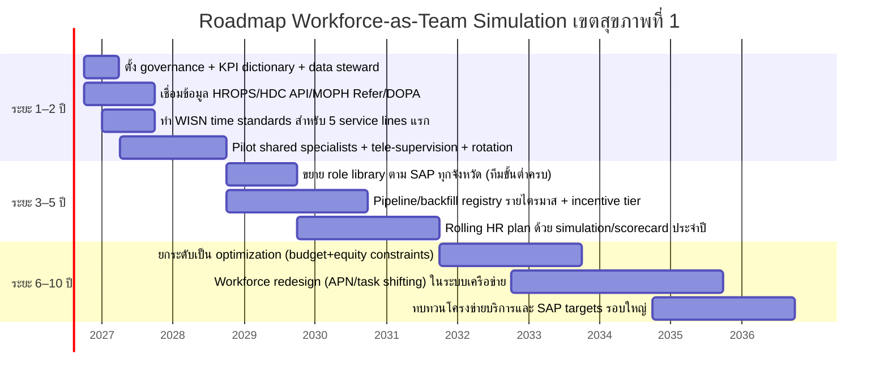

# รายงานวิเคราะห์แนวคิด Workforce‑as‑Team Simulation เพื่อปิดช่องว่างบริการและจัดทำแผนอัตรากำลัง 5–10 ปี เขตสุขภาพที่ 1

## Executive Summary
แนวคิด “workforce‑as‑team” แบบเกมบริหารทีม (Championship Manager‑style) สามารถประยุกต์เป็นเครื่องมือเชิงนโยบายของเขตสุขภาพที่ 1 เพื่อทำให้ “การเติมบุคลากร” เชื่อมกับ “ผลลัพธ์บริการที่วัดได้” เช่น refer‑out/refer‑in, ระยะรอผ่าตัด/หัตถการ, จำนวน intervention เฉพาะทาง, case‑mix และความปลอดภัย/ความล้า โดยตั้งสมมติฐานว่า **เติมคนอย่างเดียวไม่พอ ต้องเติมเป็นทีมตามสายบริการ (service line) และจัดเครือข่าย hub‑and‑spoke + tele + rotation** เพื่อให้ระบบรองรับจริง  

เอกสารยุทธศาสตร์เขตสุขภาพที่ 1 (ร่างปี 2569–2571) ระบุเป้าประสงค์ “มีกำลังคนที่เหมาะสมและสมรรถนะรอบด้าน” และเน้นการจัดการกำลังคนแบบเครือข่าย การคาดการณ์ล่วงหน้า และ Smart Operations/ดิจิทัลเฮลท์ fileciteturn0file1 พร้อมระบุ service plan โรคสำคัญ (NT2C2S: NCDs, Trauma, Cancer, CKD, Stroke, STEMI) และการ “จัดระบบการส่งต่อ” เป็นแกนสำคัญ fileciteturn0file0 รายงานนี้จึงเสนอกรอบหลักฐานสากล + กลไกเชิงปฏิบัติ + KPI/roadmap ที่พร้อมใช้ทำ HR Blueprint 5–10 ปีในระดับเขต

## หลักฐานเชิงทฤษฎีและแนวปฏิบัติที่เกี่ยวข้อง
แนวทางระดับโลกที่ “มีหลักฐานและอธิบายเชิงเหตุผลได้” สำหรับปิดช่องว่างบริการและวางกำลังคน มีสาระสำคัญดังนี้

การวางกำลังคนตามภาระงานจริง (Workload‑based planning: WISN)  
แนวทาง WISN ขององค์การอนามัยโลกใช้ “กิจกรรมงาน + มาตรฐานเวลา” เพื่อคำนวณกำลังคนตาม workload และช่วยชี้ความขาด/เกินระหว่างหน่วยบริการ citeturn0search0turn0search4turn0search12 ข้อดีคือโปร่งใส ตรวจสอบได้ และเหมาะกับการทำ rolling plan; ข้อจำกัดคือคุณภาพข้อมูล workload และการกำหนด time standards ต้องร่วมกันทั้งระบบ

การกระจายงานและปรับบทบาท (Task shifting / Team‑based care)  
แนวทาง task shifting นิยามเป็น “การกระจายงานอย่างมีเหตุผลในทีมบุคลากร” ย้ายงานบางส่วนจากผู้มีคุณวุฒิสูงไปสู่ผู้ฝึกสั้นกว่าที่ทำได้ภายใต้การกำกับ เพื่อเพิ่มการเข้าถึงและใช้ทรัพยากรอย่างคุ้มค่า citeturn0search1turn0search13 ข้อดีคือเพิ่ม productivity และลดคอขวดในสาขาวิกฤต; ข้อจำกัดคือกรอบกฎหมายวิชาชีพ มาตรฐานการฝึก และการกำกับคุณภาพ

การใช้บทบาทพยาบาลขั้นสูง (Advanced Practice Nursing)  
รายงาน OECD ชี้ว่าหลายประเทศใช้พยาบาลขั้นสูง/NP เพื่อรองรับภาระ primary care และโรคเรื้อรัง โดยช่วยด้าน access/continuity และลดภาระแพทย์ เมื่อมีกรอบบทบาทและการฝึกที่ชัดเจน citeturn0search2turn0search6 ข้อจำกัดคือการกำหนดขอบเขตการปฏิบัติ ค่าตอบแทน และการยอมรับในระบบ

การจัดเครือข่ายบริการแบบศูนย์กลาง (Hub‑and‑Spoke / Centralisation)  
หลักฐานจากระบบ stroke ของอังกฤษพบว่าการจัดบริการเฉียบพลันให้รวมศูนย์ (hyperacute stroke units) สามารถลด mortality/ระยะนอน และเพิ่มการให้บริการตามแนวทางมาตรฐาน แต่ต้องลงทุนการเปลี่ยนแปลงระบบส่งต่อ/การวางแผน/บริบทการเดินทางให้เหมาะสม citeturn1search0turn1search4 ข้อจำกัดคือความเสี่ยงด้าน equity หากการเข้าถึง/EMS ไม่พร้อม

การใช้ผู้เชี่ยวชาญร่วมผ่าน tele‑mentoring (Shared specialists via Project ECHO)  
งานวิจัยใน NEJM แสดงว่าโมเดล ECHO ทำให้การรักษาโรคเฉพาะทาง (ตัวอย่าง HCV) ในพื้นที่ขาดแคลนสามารถได้ผลลัพธ์ไม่ด้อยกว่าศูนย์ผู้เชี่ยวชาญ โดยใช้ “ผู้เชี่ยวชาญเป็น hub ถ่ายทอดความรู้และกำกับการรักษา” citeturn0search3turn0search7 ข้อดีคือขยายศักยภาพโดยไม่ต้องกระจายผู้เชี่ยวชาญทุกแห่ง; ข้อจำกัดคือภาระงาน hub และต้องมีมาตรฐานแนวทางรักษา/ข้อมูลติดตาม

Telemedicine/Telehealth เพื่อข้ามข้อจำกัดภูมิศาสตร์  
รายงานองค์การอนามัยโลกระบุว่า telemedicine ช่วยข้ามข้อจำกัดด้านภูมิศาสตร์และเพิ่มการเข้าถึง โดยเฉพาะพื้นที่ชนบท/ด้อยโอกาส citeturn2search0turn2search4 งานกรณีศึกษาของระบบ VA (สหรัฐฯ) รายงานผลเชิงประจักษ์ด้านการลดการนอน/การ admission และความพึงพอใจใน home telehealth เมื่อขยายระบบอย่างเป็นองค์รวม citeturn1search2turn1search14 ข้อจำกัดคือ digital divide ธรรมาภิบาลข้อมูล และการบูรณาการ workflow หน้างาน

## กลไกเชิงปฏิบัติที่เหมาะสมกับไทยและเขตสุขภาพที่ 1
กรอบนโยบายระดับประเทศ OROP‑OH มุ่ง “จากการทำงานแยกส่วนสู่ระบบเดียวกัน” ครอบคลุม 3 มิติหลัก (ระบบบริการ–ทรัพยากรบุคคล–การเงินการคลัง) และเน้นบริหารทรัพยากรร่วมในระดับเขต/จังหวัด citeturn1search3turn1search7 ซึ่งสอดคล้องกับยุทธศาสตร์เขตสุขภาพที่ 1 ที่เน้นการจัดการกำลังคนแบบหลากหลาย การคาดการณ์ล่วงหน้า และ Smart Operations/ดิจิทัล fileciteturn0file1

ข้อเสนอ “ชุดกลไก” ที่เหมาะกับเขต 1 (เชิงระบบและเชื่อม Service Plan)
- HR Blueprint แบบ workload‑based: ใช้แนว WISN เพื่อทำ time standards ราย service line และคำนวณ FTE ตามภาระงานจริง แล้วทำ rolling plan รายปี citeturn0search0turn0search4  
- SAP × OROP‑OH integration: ใช้ระดับ SAP ของโรงพยาบาลเป็น “กรอบ minimum capability” แล้วกำหนด role library แบบทีมบริการ (แพทย์เฉพาะทาง + พยาบาลเฉพาะทาง + เภสัช/เทคนิค/กายภาพ) ต่อ service line ที่เขตให้ความสำคัญ (NT2C2S) fileciteturn0file0turn0file1  
- Pipeline / Backfill: ทำทะเบียนผู้ส่งเรียน–ช่วงรอ–กลับมา และกำหนด backfill window รายไตรมาส (เชื่อมตารางเวรหมุนเวียน/tele‑support) เพื่อไม่ให้บริการสะดุด  
- Hub‑and‑Spoke + Shared specialists: จัด “ผู้เชี่ยวชาญร่วมเขต” สำหรับ stroke/STEMI/CKD/Onco/ER/MH โดยกำหนด SLA (วันออกตรวจ/response time) และใช้ tele‑supervision (เทียบหลักฐาน hub‑spoke + ECHO + telemedicine) citeturn1search0turn0search3turn2search0  
- Team‑based roles และพยาบาลเฉพาะทาง: ใช้บทบาทพยาบาลเฉพาะทางเป็น productivity multiplier ใน ICU/Stroke/Dialysis/Chemo/ER ตามหลักฐาน task shifting/APN citeturn0search13turn0search2  
- Retention/Incentive พื้นที่ห่างไกล: รวมแพ็กเกจแรงจูงใจที่ผูกกับความยากพื้นที่ + career path + การศึกษาต่อ และใช้ข้อมูล burnout/turnover เป็น trigger เชิงบริหาร (สอดคล้องยุทธศาสตร์ “มีกำลังคนเหมาะสม” ของเขต) fileciteturn0file1  
- Digital enablement: เชื่อมข้อมูลกำลังคนและบริการผ่าน HROPS + HDC API + MOPH Refer เพื่อให้ “เห็นคอขวดจริง” และทำ simulation ได้ต่อเนื่อง citeturn2search3turn2search6turn1search7  

## โมเดลเชิงเหตุผลเชื่อมการเติมบุคลากรกับผลลัพธ์บริการ
โมเดลมาตรฐานที่เสนอให้เขตใช้ร่วมกัน (เพื่อให้แปลผลได้ตรงกัน) คือ
Population → Prevalence/Incidence → Expected cases → Intervention rate → Workload → Required FTE

ตัวอย่างสมการ (ใช้เป็น template ใน simulation)
- ExpectedCases = Population × Prevalence (โรคเรื้อรัง) หรือ Population × Incidence (โรคเฉียบพลัน)  
- InterventionDemand = ExpectedCases × EligibilityRate × CoverageRate  
- WorkloadMinutes = Σ(InterventionDemand_i × TimeStandard_i) + Σ(BedDays_j × NursingMinutes_j)  
- RequiredFTE = WorkloadMinutes ÷ ProductiveMinutesPerFTE  
- WaitingTimeApprox ≈ Backlog ÷ ThroughputPerPeriod

สมมติฐานที่ต้องกำหนดร่วมกัน (เพื่อให้ใช้ได้จริง)
- Time standards ต่อกิจกรรมหลักตั้งตามแนว WISN และทบทวนรายปี citeturn0search4  
- Ramp‑up: บุคลากรใหม่/กลับจากฝึกมี productivity <100% ใน 1–2 ไตรมาสแรก  
- Team multiplier: หากขาดพยาบาลเฉพาะทาง/เภสัช/เทคนิค ผลผลิตแพทย์ลด (กำหนด coefficient ต่อ service line)  
- Referral shift: refer‑out ลดลงได้เฉพาะส่วนที่ “หลีกเลี่ยงได้” (avoidable leak) ซึ่งต้องวัดจาก reason coding ในระบบส่งต่อ

## กรอบการประเมินผลและ KPI หลังเติมกำลังคน
ฐานข้อมูลเขตควรติดตาม KPI แบบ “leading + lagging indicators” และใช้ความถี่ต่างกันตามธรรมชาติของข้อมูล

| มิติ | KPI หลัก | นิยามสั้น | ความถี่ | กรอบเป้าหมายเชิงนโยบาย (ต้อง calibrate ด้วย baseline) |
|---|---|---|---|---|
| Access | Waiting time (ผ่าตัด/หัตถการ) | median days ต่อสาขา | รายเดือน | ลดลงเป็นขั้นตาม capacity เพิ่ม (เช่น 10–30% ใน 12–24 เดือน) |
| Network | Refer‑out/in by reason | จำนวน/สัดส่วน refer‑out/in แยกเหตุ no specialist/equipment/overload | รายสัปดาห์/เดือน | ลด “avoidable refer‑out” 20–40% ใน 24 เดือน |
| Capability | Procedure volume | thrombolysis/cath/chemo/dialysis/OR | รายเดือน | เพิ่มจนผ่าน minimum volume gate ของบริการเครือข่าย |
| Complexity | CMI/DRG weight | สะท้อนความซับซ้อนผู้ป่วย | เดือน/ไตรมาส | เพิ่มใน hub และสมดุลใน spoke ตามบทบาท |
| Clinical outcome | Mortality/complication/readmission | เฉพาะโรค/บริการ | ไตรมาส/ปี | เป็น lagging indicator ใช้เทียบก่อน‑หลัง |
| Workforce wellbeing | OT/burnout proxy/turnover | OT ต่อ FTE, sick leave, turnover | เดือน/ไตรมาส | ตั้ง trigger เพื่อ backfill/ปรับเวรทันที |

ข้อมูลกำลังคนเฉพาะทางในเขต (ตัวอย่าง 6+1 สาขา) ที่รวบรวมไว้สามารถเป็น baseline ศักยภาพและช่องว่าง โดยแสดงจำนวนผู้เชี่ยวชาญต่อโรงพยาบาลและภาระงานประกอบ (เช่น SumAdjRW/CMI หรือ major surgery/OR) fileciteturn0file2 ซึ่งควรถูกเชื่อมเข้าระบบ KPI/Simulation โดยตรง

## บทเรียนจากต่างประเทศที่ควรระวัง
- Centralisation/hub‑spoke อาจเพิ่มความเหลื่อมล้ำ หากระบบส่งต่อ/EMS/การเดินทางไม่พร้อม แม้ผลลัพธ์รวมดีขึ้น citeturn1search4turn1search0  
- Task shifting/APN ต้องมีมาตรฐานสมรรถนะ + supervision + กติกาวิชาชีพ ไม่เช่นนั้นเสี่ยงคุณภาพและความขัดแย้งบทบาท citeturn0search13turn0search2  
- Telemedicine ขยาย access ได้ แต่ต้องจัดการ digital divide และความมั่นคงปลอดภัยข้อมูล; WHO แนะนำให้พิจารณาประโยชน์‑ความเสี่ยง‑ความเป็นธรรมเป็นองค์ประกอบ citeturn2search1turn2search0  
- Data gaps คือความเสี่ยงอันดับหนึ่ง: FTE ปฏิบัติงานจริง, time standards, reason coding ของ refer และข้อมูล waiting list ต้องนิยามเดียวกัน ไม่เช่นนั้น simulation จะ “แม่นแบบผิด”  
- Unintended consequence: เติมคนแล้ว demand เพิ่ม (induced demand) ทำให้ waiting ไม่ลด ต้องมีกลไก gatekeeping/clinical governance ควบคู่

## ข้อเสนอเชิงนโยบายสำหรับผู้บริหารเขต
- ยกระดับ HR Blueprint เป็น “แผนกำลังคนเชิงผลลัพธ์” โดยกำหนด KPI เป้าหมายร่วม (refer‑out avoidable, waiting time, procedure volume, burnout) และทบทวนแบบ rolling plan รายปี fileciteturn0file1  
- จัดตั้ง “Shared Specialist Pool + Tele‑supervision” ใน service line วิกฤต (Stroke/STEMI/CKD/Onco/ER) พร้อม SLA และงบสนับสนุนการหมุนเวียนตาม OROP‑OH citeturn1search3turn2search0  
- กำหนด “Team‑based minimum roles” ต่อ SAP level ไม่ใช่แค่จำนวนแพทย์ (เพิ่มพยาบาลเฉพาะทาง/เภสัช/เทคนิค/กายภาพตาม service line) citeturn0search2turn0search13  
- สร้าง Pipeline/Backfill Registry ระดับเขต (รายไตรมาส) ก่อนอนุมัติส่งเรียนทุกกรณี เพื่อป้องกันช่องว่างบริการ  
- ลงทุน “Data‑to‑Decision” (HROPS + HDC API + MOPH Refer) เพื่อทำ dashboard และ simulation ที่ใช้ประชุมจริงทุกไตรมาส citeturn2search3turn2search6turn1search7  

## ข้อสมมติฐานหลักและข้อมูลที่ต้องสำรวจ
สมมติฐานหลัก
- มี baseline FY แยกไตรมาส (FY‑Q) เป็นมาตรฐานเดียวของเขต  
- CA/PA/สมรรถนะบทบาทและพยาบาลเฉพาะทาง หากยังไม่มีให้ใช้การประเมินแบบ Lite รายไตรมาสก่อน  
- กำหนด time standards ตามแนว WISN และทบทวนรายปี

ข้อมูลที่ต้องสำรวจ (สั้น)  
- FTE ปฏิบัติงานจริงแยกสาขา/บทบาท (HROPS + reconciliation) citeturn2search3  
- Workload ราย service line (HIS/43แฟ้ม/HDC API) citeturn2search6  
- Refer‑out/in + reason + SLA (MOPH Refer) citeturn1search7  
- Waiting list ผ่าตัด/หัตถการเฉพาะทาง (ต้องสำรวจข้อมูล: export จาก OR scheduling)  
- Population base รายอายุ (DOPA/NSO) citeturn2search6  

## Roadmap ระยะ 5 ปีและ 10 ปี


## Executive one-page summary
| วาระผู้บริหาร | กลไกที่เสนอ | ผลลัพธ์บริการที่คาดหวัง | KPI ที่ต้องเห็น | แหล่งข้อมูลหลัก | รอบทบทวน |
|---|---|---|---|---|---|
| ลด refer‑out เกินจำเป็น | hub‑spoke + shared specialists + tele | refer‑out(reason) ลด, self‑contain เพิ่ม | refer‑out/in by reason | MOPH Refer, HDC citeturn1search7turn2search6 | รายไตรมาส |
| ลด waiting เฉพาะทาง | เพิ่ม throughput + ทีมครบ + backfill | waiting ลดอย่างมีนัย | median waiting time | OR/clinic scheduling (ต้องสำรวจข้อมูล) | รายเดือน |
| เพิ่ม intervention ตาม SAP | team‑based minimum roles | volume เพิ่มผ่านเกณฑ์ | procedure volume | HIS/HDC API citeturn2search6 | รายเดือน |
| ลด burnout/รักษาคน | workload‑based + job redesign/APN | OT ลด, turnover ลด | OT/turnover | HROPS + การเงิน citeturn2search3 | รายไตรมาส |
| ทำแผน 5–10 ปีแบบ rolling | WISN + simulation dashboard | แผนปรับได้จริงตามข้อมูล | scorecard รวม | RH1+HDC+HROPS+Training registry fileciteturn0file1 | รายปี |

```text
แหล่งข้อมูล/อ้างอิงที่ควรใช้ (ลำดับความสำคัญ)
- RH1 (ยุทธศาสตร์/เอกสารเขตสุขภาพที่ 1): https://www.rh1.go.th/
  - เอกสารยุทธศาสตร์เขตสุขภาพที่ 1 ปี 2569–2571 (ไฟล์ภายในที่แนบ)
- DOPA/NSO (ประชากร ฐานคำนวณ demand): https://stat.bora.dopa.go.th/new_stat/webPage/statByYear.php
- MOPH/HDC/HDC API (ตัวชี้วัดบริการ/ภาระงาน): https://hdc.moph.go.th/  และ https://api-hdc.moph.go.th/
- HROPS (กำลังคน/การลา): https://hrops.moph.go.th/
- Training registry (ต้องสำรวจข้อมูล: รายชื่อส่งเรียน–กลับ): ฟอร์มมาตรฐานเขต + อัปโหลดรายเดือน
- SAP manual (นิยามระดับ/เกณฑ์ขั้นต่ำ/ตัวชี้วัด): ใช้คู่มือ SAP ล่าสุดของกระทรวงสาธารณสุข
- หลักฐานสากล: WHO WISN https://www.who.int/tools/wisn | WHO Task shifting https://iris.who.int/items/b5c624db-537c-4e80-83f2-269f063fb8bb
  OECD APN https://www.oecd.org/en/publications/advanced-practice-nursing-in-primary-care-in-oecd-countries_8e10af16-en.html
  NEJM Project ECHO https://www.nejm.org/doi/full/10.1056/NEJMoa1009370
  Stroke centralisation evidence (BMJ) https://www.bmj.com/content/364/bmj.l1
  WHO telemedicine/digital interventions https://iris.who.int/items/0365143e-27dc-418e-ad66-ae095df34fda และ https://www.who.int/publications/i/item/9789241550505
```